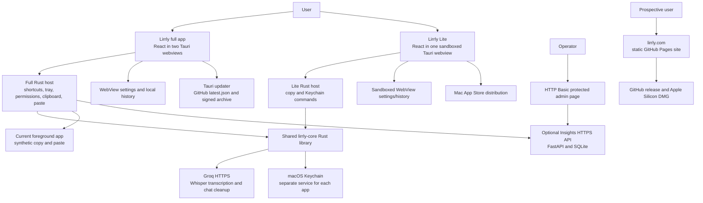

# Lirrly — complete project architecture

Canonical architecture for the **whole project**, first reviewed against the workspace on **2026-09-12**, re-verified against source on **2026-09-13**, and updated on **2026-09-14** after two rounds of repairs landed (audit A01, A05, A17, A32, then A02, A07, A09, A10, A22, A29, A33 and the transport half of A11). Product source baseline: local branch `lirrly`, commit `4d22d13`; public `origin/main` observed at `ae3b9bad`. **2026-09-26:** 0.4.2 published through the provenance gate — public `main` and tag `v0.4.2` both at `ab8661a`, which declares 0.4.2 — and the first real in-app update was run on hardware (§8). Architecture maintenance added during that audit is still a local, uncommitted change. External observations below are dated snapshots, not permanent status guarantees.

This document describes what exists, including defects and boundaries. It does not certify that the app is ready to launch. The companion assessments are [FULL-AUDIT-2026-10-05.md](FULL-AUDIT-2026-10-05.md) (latest re-audit; findings A37–A48) and [FULL-AUDIT-2026-09-12.md](FULL-AUDIT-2026-09-12.md) (the A01–A36 baseline).

## Reading map

1. §1 Product/system map and distribution boundaries
2. §2 Repository, runtime, and dependency structure
3. §3 Full app: startup, onboarding, settings, recording, transforms, paste, history
4. §4 Lite: single-window journey and App Store boundary
5. §5 Shared core: provider calls, prompts, Keychain, failure behavior
6. §6 Data, events, commands, permissions, and external traffic
7. §7 Insights administration and operations
8. §8 Website, distribution, releases, and updates
9. §9 Licensing and commercial architecture
10. §10 Verification and launch boundaries
11. §11 How to keep this file accurate
12. Generated versions, native commands, and complete source/configuration index

## 1. System at a glance

Lirrly is a macOS speech-to-text product with **two desktop applications**, **one shared Rust library**, **a static marketing website**, and **an optional diagnostics/feedback service**. The deployed speech/cleanup engine is **Groq cloud batch inference**. There is no implemented offline/local model, live incremental transcription engine, customer cloud account system, payment service, or subscription enforcement.



Arrows show intended application calls. The `Full → Native` transcription edge was broken by an IPC argument-name mismatch until 2026-09-14 (audit A01); the payload key is now correct in both apps and a repository-wide contract check enforces it (§11). A diagram arrow is still not evidence of successful native end-to-end execution — the repaired path has been proven in tests, not yet in a signed build against a real microphone.

| Component | Location | Responsibility | Current boundary |
|---|---|---|---|
| Full app 0.4.3 | `lirrly/` | Dictation anywhere, FlowBar, transforms, dictionary/snippets, history, updater | Direct distribution; uses Accessibility/private macOS window support; not sandboxed for MAS |
| Lite 1.0.3 | `lirrly-lite/` | Dictate/edit/transform/copy within its own window | Separate sandboxed MAS app (1.0.2 live since 2026-09-30; 174 storefronts including the EU as of 2026-10-03; 1.0.3 = the v9 icon plus core's one retry on a short Groq 429, no Lite source change); proprietary source kept out of public clean cut |
| Core 0.1.0 | `crates/lirrly-core/` | Groq multipart/audio and chat requests, shared prompts, Keychain abstraction | Rust library compiled into both binaries; no independent server |
| Insights | `insights/` | Opt-in error reports, manual feedback, basic admin dashboard | Private FastAPI service; independent from inference; full app only |
| Website | `site/` | Marketing, downloads, privacy page, install command | Static files served through GitHub Pages/custom domain |
| Release tooling | `scripts/`, private `signing/` | Build/sign/notarize/package/upload and update tap | Local Mac tooling with external publishing side effects |

## 2. Repository and build structure

The root is not a JavaScript monorepo workspace or Cargo workspace. There are **two separate npm packages and three separate Cargo crates/lockfiles**. Both desktop crates reference `../../crates/lirrly-core` via a path dependency. Run checks from each actual package/crate directory; checking the full Rust application alone does not execute the dependency crate's unit tests.

- `lirrly/src/main.tsx` chooses Settings or FlowBar from the Tauri window label; `?view=` supports browser previews.
- `lirrly/src/settings/` contains the large Settings/Hub page and its visual helpers/styles.
- `lirrly/src/flowbar/` owns the recording state machine, floating controls, waveform, error messages, and global dictation/transform listeners.
- `lirrly/src/onboarding/` contains first-run setup and its styling.
- `lirrly/src/lib/` contains audio capture, inference orchestration, settings/history, shortcut formatting, diagnostics, and updater clients.
- `lirrly/src-tauri/src/main.rs` enters `lirrly_lib::run()`; `lib.rs` owns native commands, windows, tray, shortcuts, native state, paste, and diagnostics transport.
- `lirrly-lite/src/App.tsx` owns most Lite UI/recording orchestration; `audio.ts`, `store.ts`, `Waveform.tsx`, and `styles.css` provide its support layers.
- `lirrly-lite/src-tauri/src/lib.rs` registers only Lite's provider/key commands and clipboard/opener/store plugins.
- `crates/lirrly-core/src/groq.rs` implements provider calls and shared prompts. `keychain.rs` scopes credential storage. `lib.rs` exports the library API.
- `insights/app.py` includes schemas, SQL, HTTP routes, authorization, and server-rendered HTML. There is no separate admin frontend bundle.
- `site/index.html`, `ar/index.html`, `main.js`, `styles.css`, `privacy.html`, `robots.txt`, `llms.txt`, and `CNAME` are served directly without a build step.
- `docs/adr/001` through `005` record stack, full-app distribution, planned local/streaming work, licensing, and Lite distribution decisions. ADR-003 is a plan, not installed functionality.
- `docs/RELEASE.md` is the release runbook; `docs/appstore/` is private listing/submission documentation.
- `docs/screenshots/`, `appstore-screenshots/`, desktop `icons/`, and `site/img/` contain existing assets. `site/fonts/` contains self-hosted fonts. These are not runtime services.
- **App icon (2026-10-01):** both apps' `src-tauri/icons/` sets and the four `site/img/` icons come from the owner's **v9** artwork (`app-icon-output/2026-10-01/lirrly-v9-r-hook.png`), regenerated with `tauri icon` / plain resizes. v9 is the June v8 woven-waves image with one change made by image generation (gpt-image-2 through the Hermes helper, fed v8 plus a one-change prompt): the tallest bar gained an r hook, so the letters read "lirrly" instead of "lirlly". Measured against v8: bar tops unchanged to the pixel, 0.03% of pixels outside the hook differ strongly. The published builds (full 0.4.2, Lite 1.0.2) still carry the older readable wordmark; v9 ships with the next builds. Remaining known property, verified on this macOS 26.6 machine: the artwork sits on an opaque black canvas (no alpha), which macOS 26 clips into the system rounded rectangle but macOS 12–15 show as a black square — a defect every Lirrly icon so far has had. Fixing it needs another generated image (AGENTS.md forbids editing assets with code) and the helper on the VPS currently hardcodes `background: opaque`. The tray template icon (`tray-icon-16/32.png`) is separate and unchanged. **Since 2026-10-05 the in-app marks are v9 too:** the Hub sidebar and onboarding show `lirrly/src/assets/lirrly-logo.png` (a byte copy of `src-tauri/icons/128x128@2x.png`) through `LogoMark`, replacing the drawn `WaveMark` SVG, and the website's nav/footer show `site/img/icon-192.png` instead of the CSS five-bar mark; the rounding is display CSS only. The monochrome tray glyph still predates v9 — a matching template image needs image generation.
- `design/`, root `HANDOFF-*`, `PARITY-PLAN.md`, and `WISPR-CLONE-BLUEPRINT.md` are historical/reference material. They must not override current code evidence.
- `.context/` holds audit evidence and collaboration scratch files; `handoffs/` and `MASTER-HANDOFF.md` retain local history. `signing/` holds private operational scripts and credentials and must remain excluded from publication.

Both apps use React 19, TypeScript, Vite 7, Tauri 2, Rust 2021, and the OS WebView. Full app adds global-shortcut, autostart, notification, process/relaunch, updater, clipboard-manager, opener, and store plugins; Lite registers only opener, clipboard-manager, and store. Core uses reqwest/rustls, serde_json, base64, and keyring's Apple backend. `enigo` is a full-app dependency for synthetic keys. Version ranges are resolved by each lockfile; the generated source index includes lockfiles so dependency changes trigger a review.

## 3. Full app runtime

### Startup, windows, and tray

Tauri config creates a main Hub window (1180×760; minimum 860×540) and a transparent, non-focused, always-on-top FlowBar window. The Rust host uses macOS accessory activation policy, so this is a menu-bar resident application. Closing the main window hides it; Quit in the tray exits the process. The FlowBar is positioned bottom-center against a monitor's full size and position (not its work area) and resized through native commands.

Native state includes:

- `ShortcutRegistry`: mutex-protected action→accelerator mappings. Since 0.4.4 it records only bindings that actually registered (audit A38): it starts empty, setup inserts on success only, and `update_shortcut` refuses a rebind whose old binding cannot be unregistered, re-registers the previous binding (or the default) when the new one fails, and drops the entry if even that fails.
- `PasteLock`: Tokio mutex shared by synthetic selection copy and paste operations; contention returns a busy error.
- `LastTranscript`: last output submitted to paste (including transforms), recorded before paste succeeds; memory-only.
- `PasteMenuItemHandle`: enables the tray's last-transcript item after a paste.

Default global shortcuts are Command+Shift+D for dictation and Option+T for transform. The frontend reapplies saved shortcuts. **Neither registration is fatal:** until 2026-09-14 the dictation binding propagated its error out of `setup`, so another app holding ⌘⇧D aborted the launch entirely and left no way to reach Settings and rebind. Both now log and degrade — the FlowBar record button and the tray still work. Rebinding tries to preserve the old mapping on conflicts. **A38 (0.4.4):** a default binding another app held at launch used to stay dead all session, because the registry recorded it anyway and the Hub's re-apply skipped defaults. The Hub now re-applies both bindings, defaults included, at startup; any that still fail are stored under `lirrly:shortcut-conflicts` (`src/lib/shortcutConflicts.ts`), announced once by notification when error notifications are on, and shown in the Shortcuts panel per action until that binding is successfully changed or reset. No hold-to-talk implementation exists.

Tray Home/Shortcuts navigate the Hub. Tray language items open settings rather than setting a language directly. Tray Check for updates opens the Hub at Settings→Account and runs a visible update check there (audit A36, 0.4.3; until then it opened GitHub Releases, so an update started from the menu bar skipped the signature-checked in-app path). Help/support/feedback tray actions open GitHub issues.

### Onboarding and settings

The five-step wizard runs Welcome → Permissions → Engine/API key → First dictation → Done. Shortcut configuration is in the Hub, not a separate wizard step. The key-entry UI temporarily holds the typed key in WebView memory and sends it to Rust for Keychain storage. Existing keys are never returned to the WebView by a get-key command. Key validation currently depends on a chat request, so provider/model availability and key validity are coupled.

The Hub exposes Home, History, Insights, Dictionary, Snippets, Transforms, Styles, Scratchpad, Shortcuts, Settings, and Account. **Hub Insights** means local personal usage statistics; it is separate from the operator's **Insights server**. Scratchpad/command mode and local-provider UI are not completed execution paths.

`AppSettings` includes provider/model/language, per-context cleanup levels, dictionary, snippets, transform library/active transform, FlowBar visibility/opacity, chosen microphone, autostart, display name, history preference, analytics consent, notification preferences, and shortcut mappings. Defaults: Groq, `whisper-large-v3-turbo`, auto language, history on, analytics off, AI cleanup enabled, personal context light cleanup. Groq withdraws models, so every model id the app can send has a retirement list: `RETIRED_CHAT_MODELS` migrates `cleanupModel` and, since 2026-09-25 (audit A35), `RETIRED_SPEECH_MODELS` migrates `model` — previously a withdrawn speech model survived upgrades and broke every dictation silently. The Settings model list carries only ids confirmed live; `GET /v1/models` is a required pre-release check. Since Wave 4 (2026-09-17, audit A19) the configured styles actually apply: `activeCtx` names the style dictations use, chosen in Settings → Styles ("Use for dictation"), and `resolveCtx` switches to the **email** style when the recorded paste target is a known mail client (Mail, Outlook, Thunderbird, Spark) — the only per-app detection attempted, because anything less clear-cut would apply settings the user never picked. The FlowBar's inline polish selector reads and writes the active style's level, no longer always Personal.

Settings are persisted in WebView localStorage (`lirrly.settings`). Legacy `murmur.settings` is supported for migration. A `settings-changed` Tauri event coordinates reloading between windows. Writes are not transactional across windows. Once the Keychain write is confirmed, `purgeStoredApiKey()` deletes the credential from **every** namespace the app has written; before 2026-09-14 only the current one was blanked, so upgraded installs kept a readable key in `murmur.settings` indefinitely.

### Recording and transcription

Intended sequence:

1. FlowBar receives the dictation shortcut, or a user clicks its record control.
2. `startRecording()` requests microphone access, optionally for `selectedMicId`, chooses a supported MediaRecorder MIME, creates an AudioContext/analyser, and accumulates chunks in memory.
3. UI changes from idle to listening and displays the live waveform. A five-minute timer stops recording.
4. Stop resolves a Blob, stops tracks/closes capture resources, and changes UI to processing.
5. `engine.ts` base64-encodes the complete Blob. Up to 60 dictionary words become the Whisper prompt hint.
6. Frontend invokes native `transcribe`; Rust loads the key and calls the shared Groq client.
7. The returned text undergoes deterministic cleanup, optional AI cleanup for medium/high levels, then snippet expansion.
8. Final text is written to history when enabled and sent to `paste_text` together with the **paste target** — the frontmost app's bundle id, recorded the moment the user stopped speaking. Completion drives Home/History refresh and the onboarding celebration. Failure is mapped to a FlowBar error and an opt-in diagnostic report.

This is **batch capture → batch upload**, not streaming. MediaRecorder chunk events do not mean server streaming. No durable audio spool, retry queue, raw/final transcript pair, request cancellation, provider fallback, or exactly-once insertion record is implemented.

**IPC contract (was the blocker for step 6).** `#[tauri::command]` in Tauri 2 defaults to `rename_all = "camelCase"`, so the generated dispatcher looks up the payload key `audioB64`. Until 2026-09-14 `engine.ts` sent `audio_b64`; because Tauri resolves argument keys by exact match with no snake_case fallback, every dictation failed with `command transcribe missing required key audioB64` before the Keychain or Groq was touched. The mismatch existed in the first prototype commit (`40e8235`) and in every revision since, including the published `main` and the `v0.4.1` tag — so no released full-app build could dictate. `engine.ts` now sends `audioB64`, matching Lite and every other command. Two guards prevent recurrence: a unit test asserting the serialized payload keys (helper-level tests cannot see this boundary), and `scripts/architecture.py --check`, which compares every literal `invoke()` payload in both apps against the Rust signature it targets and fails on an unexpected or missing key.

**Microphone ownership.** `startListening` claims synchronously before awaiting `getUserMedia`, so two fast shortcut presses cannot each open a device; a start that loses the race disposes its recorder rather than stranding it. `Recorder` owns its resources: `stop()` is idempotent, `dispose()` releases without producing audio, and every exit path — setup failure, recorder error, an inactive `stop()` that throws, unmount — runs the same release. Until 2026-09-14 none of this existed and an abandoned recorder left the microphone live.

**Recovery.** The captured audio is retained in `pendingTakeRef` until the text is delivered, so a network failure, a 429 or a truncated response costs a click on **Retry** rather than the take. Delivery is one function shared by the first attempt and the retry, so they cannot drift. A failed history write is reported but never blocks delivery. The take is dropped on success, when a new recording starts, when the toast expires, and for errors a retry cannot fix (bad key, oversized recording) — so nothing is held that the user has no way to reach.

**Closed on this path in 0.4.3 (branch `wave1-0.4.3`):** A04 — history mutations are native and serialized (see History below); A06 — a length-truncated model response is an error, never a shorter answer (§5); A08 — the paste is held to the app the user was in (see Paste below). The retained take also keeps its target, so **Retry** delivers to the original app or copies.

**Closed 2026-09-17 (Wave 4, branch `wave2-lite`):** A18 — full-fidelity pasteboard restore gated on `changeCount` (see Paste below); A19 — the per-context styles actually apply (see Settings above); A20 — the Shortcuts **Reset** persists only combos whose native registration succeeded, keeps the live binding otherwise and says so, instead of saving defaults that were never registered; A21 — the FlowBar's visibility preference is reconciled at startup (the window config always creates it visible), Settings routes *hiding* through the FlowBar's own settings-changed handler so a mid-take bar is never hidden (reset() re-applies the preference when the take ends), and a native `set_tray_recording` command puts a ● title on the menu-bar item while the microphone is open — the one indicator that survives every window being hidden; A23 — every Settings toggle is a named `role="switch"` (the inert "App updates — coming soon" one is truly `disabled`), the FlowBar toast and both Lite status lines are `role="status"`/`role="alert"` live regions, and transcript/history text uses `dir="auto"` per element instead of an all-or-nothing RTL classifier, so mixed-script paragraphs direction themselves. VoiceOver acceptance on real hardware remains untested — markup is necessary, not sufficient.

### Cleanup, snippets, and transforms

Deterministic cleanup trims whitespace, removes a small English filler-word list, strips stray leading separators, and capitalizes a leading lowercase letter. Medium/high levels optionally call Groq cleanup; errors silently return deterministic text.

Until 2026-09-14 the leading strip was `^[^\wÀ-ɏ؀-ۿ]+` — it admitted only ASCII word characters, Latin-1/Latin-Extended-A and Arabic, and deleted everything else. Devanagari `नमस्ते दुनिया` and Han `你好世界` reduced to the empty string, a leading emoji was deleted, and `-5 degrees` became `5 degrees`. Hindi is an offered transcription language, so this destroyed a language the app advertises. It is now an explicit separator class (`[\s,.;:!?…،؛۔]`), so letters in any script, digits, signs, quotes, brackets, currency and emoji all survive; capitalization is gated on `\p{Ll}` so caseless scripts pass through byte-identical. Filler removal is additionally skipped when the configured language is explicitly non-English, because `um` is an ordinary German word. Auto-detect still applies the English list — the residual known limitation.

The dictionary is a recognition hint, not automatic correction learning. Snippet expansion uses one combined regular expression. It used ASCII `\b` boundaries until 2026-09-14, which meant an Arabic trigger could never match — the required boundary does not exist between two Arabic letters — and neither could a trigger ending in punctuation such as `C++`. Boundaries are now Unicode-aware (`[^\p{L}\p{N}_]` with a lookahead; the preceding character is captured and re-emitted rather than using lookbehind, which macOS 12's WebKit lacks). There is still no recursive snippet expansion — expansion remains deliberately single-pass.

Transforms have built-ins (rewrite, summarize, formal, grammar, translate) plus custom CRUD and one active transform. Option+T captures the current selection using a clipboard sentinel and synthetic Command+C, calls Groq, then pastes the result. The shortcut fires on key-down, so before the synthetic copy the native side waits up to 700 ms for ⇧⌃⌥⌘ to lift (read live from `NSEvent.modifierFlags`; Caps Lock does not count), then gives the frontmost app up to 1 s to write the pasteboard — 0.4.3 hardening for the intermittent ⌥T failure on 0.4.2, where a copy sent while ⌥ was still held could reach the app as another chord. History's transform action transforms and copies an existing entry. The built-in full-app translate prompt has no explicit destination choice; Lite instead offers a specific English target.

No transformation preview/diff/undo ledger exists. The foreground **app** is recorded before the selection is captured and checked again immediately before the paste keystroke; switching apps during the network wait now leaves the result on the clipboard instead of typing it elsewhere. The target **field, window and selection inside that same app** are still not pinned — clicking into a different field of the same app still receives the paste.

A transform whose output hits the model's token limit fails with `output_truncated` ("Result was too long — try a shorter selection" in the FlowBar; "nothing was copied" in History) and the selection is left untouched.

### Paste and clipboard behavior

The native paste helper snapshots the prior pasteboard **in full fidelity** — every item, every declared type, raw data (audit A18; capped at 64 MB since 0.4.4 — 8 MB skipped most copied photos, A40 — above which restore is skipped) — writes the generated text, checks Accessibility, emits Command+V via enigo, waits briefly, and restores the snapshot **only if `NSPasteboard.changeCount` still matches its own write**, so anything the user copied during the wait wins instead of being clobbered. `capture_selection` uses the same snapshot/restore, so an image or file clipboard survives an ⌥T transform. **A40 (0.4.4):** its zero-width-wrapped sentinel used to be left on the pasteboard when the keystroke failed or nothing was copied; now every exit restores the user's pasteboard over whatever this flow wrote (the sentinel, or the copied selection — a blank one included), and when the snapshot was too large to restore it clears the pasteboard instead, but only if the change count still equals this flow's own last write. A failed ⌘ release after the C went out is treated as a copy that may still land. The exact module was acceptance-run on macserver (2026-09-17): a PNG+text pasteboard survived clobber→restore byte-identical, and the changeCount gate refused after a newer write. A shared try-lock serializes clipboard operations. The command updates the last-transcript state/menu before attempting paste; availability in that menu is not proof of insertion.

**Order matters here.** Until 2026-09-14 the Accessibility check ran *before* the clipboard write and returned early, so a user who declined the permission got a successful transcription and then lost it completely — while onboarding promised they could paste it with ⌘V. The write now happens first and the transcript is deliberately **not** restored away; that path returns `accessibility_not_granted_copied`, which both the dictation and transform flows treat as a completed operation needing one keystroke, surfaced as “Copied — press ⌘V to paste”. The same applies if the permission is revoked mid-flight.

**Paste target (A08, 0.4.3).** Transcription and transforms take seconds, and people switch apps while waiting. Native `paste_target` returns the frontmost app's bundle id from `NSWorkspace.frontmostApplication` — or `null` when macOS reports none or reports Lirrly itself (the bar was clicked, so there is nothing meaningful to compare). FlowBar records it when dictation stops (in parallel with stopping the recorder, so it adds no latency) and before a transform captures its selection, and passes it to `paste_text`. Immediately before the synthetic ⌘V — after the Accessibility checks, as late as possible — the native side compares it with the app now in front. On a mismatch, or when the current app is unknown, the text stays on the clipboard and `target_changed_copied` is returned; FlowBar shows "Copied — you switched apps, press ⌘V" without the Accessibility fix button, which would be misleading there. No recorded target means no check. The tray's "Paste last transcript" passes none, because it is an explicit request to paste into whatever is in front. The same bundle id is stored as the history entry's `app` field, which was declared but never populated before. `objc2-app-kit`/`objc2-foundation` 0.3.2 are direct macOS dependencies for this; both were already compiled in through tauri/tao/opener, so the lockfile gained edges only, no new crates. **Freshness verified on macserver (2026-09-16)** with an Accessory-policy AppKit probe making the same `NSWorkspace` read from a worker thread, checked against `lsappinfo front` as independent truth across five AppleScript-driven app switches: with `NSApplication.run()` on the main thread, **5/5** reads were current; without a run loop the value froze at its first read (**3/5**, stale on every real switch). Lirrly runs AppKit's run loop via tao, so it is in the first case. An end-to-end check inside the signed app is still worthwhile but no longer load-bearing.

This is synthetic input, not an acknowledged editor API. Success means the key events were sent; it does not prove that the correct field accepted text. A change of app is detected; a change of field, window or selection within the same app is not. These boundaries matter to the product promise of dependable dictation anywhere.

### History and statistics

Production history uses Tauri store at the app-data `history.json`, under `items` and `lifetime_count`; the collection is capped at 200 entries during append. Entries contain a stable `id`, final text, timestamp, optional duration, the optional `app` bundle id (populated from 0.4.3), and optional WPM/style fields. Browser previews fall back to localStorage. The file is local plaintext, not encrypted; a WebView with store permissions can access it.

**Mutation ownership (A04, 0.4.3).** The Hub and the FlowBar are separate webviews, and both used to read the list, change it, and write the whole array back. History's delete filtered a copy loaded once on mount, so deleting anything erased every dictation that had landed since the page opened; entries had no id and were matched on `at` + `text`, so identical twins were deleted together. No lock inside either webview could order the two windows. Every mutation is now a native command — `history_push`, `history_delete` (by id), `history_clear`, `history_migrate` — each running one read-modify-save under the `HistoryLock` mutex via `with_history`. Reads stay in the webviews: tauri-plugin-store hands JS `load("history.json")` and Rust `app.store("history.json")` the same in-memory `Arc<Store>` for a path (verified in plugin 2.4.3 source), so a native write is visible to the next JS read immediately, and the JS-side `lifetime_count` save writes that same cache rather than a stale copy. Ids are `h<timestamp hex>-<n>`, minted natively (the browser preview mints the same shape). `history_migrate` runs only when a well-formed entry lacks an id or the file has no list yet: it adopts the pre-store localStorage list when the file has none, backfills ids, and is idempotent, so both windows may race to it safely; malformed entries are skipped on read rather than "repaired" by a write on every read. Failed pushes are reported (and never block the paste); failed deletes and clears are shown in History and the list is reloaded from what is actually saved. History also refreshes on `dictation-complete` while open. The previous silent fallback that wrote to localStorage when the store failed — data no later read would see — is gone.

Home/Insights derive word counts, local-date buckets, duration/WPM, and streaks from capped retained history. FlowBar milestone toasts use the separate lifetime count. A separate local lifetime count can survive history clearing. Turning off future history storage is distinct from erasing existing history.

## 4. Lirrly Lite

Lite is a separate application, not a configuration switch for the full binary. It has its own npm/Cargo packages, app ID, Keychain service, sandbox container, signing profile, permissions, version, and distribution process. This separation avoids Tauri configuration overrides mutating the full app's Cargo private-API features.

Single-window journey (1.0.2): first-run **Groq disclosure/consent screen** → Settings/key setup → choose language and optional transform → click record or press Space → waveform and elapsed capture → stop → Groq transcription → cleanup → optional selected transform → editable text area → Copy. History stores up to 100 local entries and shows **all** of them (scrollable, per-entry delete, count with an at-limit note). Settings/history are WebView localStorage, not the full app's history.json, even though the store plugin is registered.

**Consent before inference (A13, 1.0.2).** Until consent is granted (`lirrly-lite:groq-consent`, an ISO timestamp) the app shows only a disclosure: voice recordings and text go to Groq's servers under the user's own key; Groq may retain content up to 30 days per its policy; nothing goes to Lirrly. The record button, Space handler and Settings toggle are all gated on it. Screenshot-seeded builds (`VITE_SCREENSHOT_TEXT`) skip the gate; shipping builds never set that variable. The matching App Privacy answer for the store (Audio Data + Other User Content, App Functionality, linked, no tracking) is recorded in `docs/appstore/lirrly-lite-metadata.md` — the 1.0.1 "Data Not Collected" answer is explicitly superseded there.

**Frontend structure (1.0.2).** The Groq pipeline lives in `lirrly-lite/src/pipeline.ts` (transcribe → cleanup → transform), the keyboard rules in `keyboard.ts`, both pure enough to unit-test; `App.tsx` orchestrates UI state. A failed cleanup or transform still falls back — but now *says so* in a notice naming exactly what is shown ("the raw transcript" / "the cleaned text"), distinguishes a length-truncated result ("cut off", A06's `output_truncated`), and offers **Retry polish** over the retained raw transcript (editor-only; history keeps the entry it already has). Failed history writes, deletes and clears surface instead of vanishing (A16); malformed stored entries and out-of-range settings values are skipped/repaired on load. Space follows testable rules (A03): no auto-repeat, no modifier, never on an interactive element (so button activation is not hijacked), never while Settings covers the recorder UI, never before consent; if a recording is running when Settings opens, a live **recording strip** with elapsed time and a Stop button renders there, so a hot microphone is always visible. `startRecording` is the full app's hardened recorder (idempotent `stop()`, `dispose()`, guaranteed release on every exit path — A02), a synchronous busy-claim prevents double-starts, and unmount disposes.

Lite uses the correct `audioB64` IPC argument (covered by the repo-wide contract check). Speech model is `whisper-large-v3-turbo`; chat model is hardcoded `qwen/qwen3.8-27b`. **Key validation (A15, 1.0.2):** `validate_api_key` checks a pasted key against Groq *before* saving, so a mistyped replacement can never displace a working key; a length-stopped reply still proves authorization (`key_check_outcome`, unit-tested). The UI distinguishes verified-and-saved / rejected (existing key untouched) / unreachable (explicit "Save unverified" choice). Copy uses only clipboard write permission and does not simulate paste into other apps.

Sandbox entitlements permit audio input and outgoing network connections, with MAS team/application identifiers in the production entitlement file. `macOSPrivateApi` is false; global shortcuts, Accessibility, enigo, tray, diagnostics, autostart, and self-updater are absent. Production bundles embed the provisioning profile from private signing storage. A local-test config exists; MAS and local-test signatures/entitlements are not interchangeable acceptance evidence.

Lite has its own eslint (type-checked) and vitest (happy-dom) configs from 1.0.2, with tests over the store (validation, the A14 fresh-preference read, failed-write surfacing, twin-safe delete, consent), the keyboard rules, the pipeline's fallback/notice behaviour, the ported recorder, and the native key-check outcome; `release-lite.sh` runs lint + tests as gates, rejects unknown arguments, asserts all five version-bearing files agree, and verifies entitlement **values** (sandbox true, identifiers exact), not just key names (A31).

Remaining lifecycle limits: text can be edited/cleared while a delayed result later replaces it (the arriving transcript is the point of the operation, but there is no merge/undo); failed *transcription* does not retain audio for retry (only the polish stages retry); the retention re-check happens at write time, not by cancelling the in-flight request. `VITE_SCREENSHOT_TEXT`/language are build-time preview inputs and must be absent from shipping builds. Existing transcript screenshots are seeded demonstrations, not recorded-speech accuracy evidence.

**Apple snapshot, 2026-09-14:** Lite 1.0.1 spent nine days in `WAITING_FOR_REVIEW` without entering review. Because `releaseType` was `AFTER_APPROVAL`, approval would have published automatically and unrecallably with the Lite defects below still present. The submission was therefore **withdrawn** on 2026-09-14 (`reviewSubmissions` canceled → `COMPLETE`; the version is now `DEVELOPER_REJECTED`), and `releaseType` was changed to **`MANUAL`** so a future approval waits for a deliberate release. The 1.0.1 build remains `VALID` and attached; resubmission does not require a new upload unless the binary changes.

**Apple snapshot, 2026-09-27: Lite 1.0.2 submitted — `WAITING_FOR_REVIEW`, `releaseType` `AFTER_APPROVAL`** (the owner asked for it to go live without another step; the defects that made auto-release dangerous are fixed in 1.0.2). The withdrawn version record was renamed 1.0.1 → 1.0.2 and given the new build (uploaded 2026-09-26 by `release-lite.sh --upload` after its full gate run). The App Privacy label now reads **Audio Data + Other User Content, used for App Functionality, linked to the user, not used for tracking** — "linked" because Apple treats personal data such as voice recordings as linked unless de-identified before collection, and Groq receives it under the user's own key. The store description's privacy paragraph was corrected to match (it had said transcripts stay on the Mac and "nothing phoning home"). Details and the watcher that follows the review: `docs/appstore/lirrly-lite-metadata.md`.

**Apple snapshot, 2026-09-30: Lite 1.0.2 approved and released (`READY_FOR_DISTRIBUTION`, 2:57 PM) — but the app had no availability record, so it was on sale in no territory.** Availability was created the same evening through the API: 174 of 175 territories (mainland China excluded for its generative-AI permit rule), new territories included. 147 storefronts, Saudi Arabia and the US among them, went to `PROCESSING_TO_AVAILABLE`; the 27 EU states stay blocked until the owner declares EU Digital Services Act trader status. A new app needs availability as well as an approval, and "live" means the public lookup returns it, not the version state. By 9:30 PM the listing was public (1.0.2, Free) and the 147 storefronts `AVAILABLE`; at about 11:37 PM the owner declared **non-trader** DSA status, which unblocked the EU: by 2026-10-03 all 27 EU storefronts were `AVAILABLE` (174 of 175 territories; mainland China excluded by choice).

**Apple snapshot, 2026-10-03: Lite 1.0.3 submitted — `WAITING_FOR_REVIEW` since 6:04 AM, `AFTER_APPROVAL`.** The first update: the v9 icon and core's short-429 retry, no Lite source change. Build 1.0.3 was `VALID` a minute after upload; the new version record inherited description, keywords, URLs, screenshots and review details, but not the promotional text, which the submission script copies. A LaunchAgent watcher (`com.mshrmnsr.lirrly-lite-103-monitor`) reports each state change and calls it live only when the public lookup returns 1.0.3.

## 5. Shared core/provider boundary

`lirrly-core` is compiled into both apps. It does not contain macOS Accessibility/global-input code, a local speech model, or a server process.

| Call | Input | External request | Output/failure |
|---|---|---|---|
| `transcribe` | Key, base64 clip, MIME, model, optional language/hint | Multipart POST `https://api.groq.com/openai/v1/audio/transcriptions` | Parsed text string; raw provider error on failure |
| `cleanup_text` | Key, transcript, model, level, language/context | Chat completion with shared system prompt | Edited string; callers may fall back silently |
| `transform_text` | Key, source text, instruction, model, language | Chat completion | Rewritten string; errors propagated |
| Keychain `has/set/load` | App service and typed key | OS Keychain APIs | Presence boolean, save/delete, private key loading in Rust |

The client normalizes audio MIME codec parameters, assigns an upload filename extension, and rejects decoded recordings above **25 MiB**. Each HTTP client has a 60-second timeout. Requests are not queued. Chat calls (cleanup and transform, both apps) retry **once** after a 429 whose `retry-after` is at most 10 s (floored at 0.5 s), because free-tier keys hit per-minute token limits on back-to-back transforms; a 429 without the header, or asking for longer, fails at once. Transcription is never retried natively — the FlowBar's Retry keeps the take instead.

**Truncation (A06, 0.4.3).** Until 0.4.3 the token budgets were fixed (cleanup 900, transform 1200) and parsing ignored `finish_reason`, so a long dictation — Arabic especially, which outgrew 900 tokens within a few minutes — came back as a plausible prefix and was pasted as if complete. `parse_chat_completion` now turns `finish_reason: "length"` into the error `output_truncated`. Budgets scale with input: every byte-level BPE token covers at least one UTF-8 byte, so byte length bounds token count from above. Cleanup gets `bytes + 256`, transform `2 × bytes + 1024` (a transform may legitimately expand), floored at the old caps and capped at 8192, since a request above a model's completion limit is rejected outright. Callers already recover without loss: the full app and Lite both fall back to the unpolished transcript when cleanup fails (silently — disclosing a skipped optional stage is still open, A15), and a failed transform leaves the selection untouched. The per-model completion limit was not re-queried for this change.

The shared prompt asks to preserve meaning and adds an explicit dialect-preservation instruction when language is Arabic. Auto-detect does not receive the same explicit Arabic branch. Shared prompt reuse reduces duplication but does not by itself establish language accuracy or preservation of names, numbers, negation, and mixed-language speech.

The default chat model appears in multiple frontend/native places despite shared core extraction. Retired model migration is a static list; it does not automatically detect future retirement. **Read-only Groq models check on 2026-09-12 confirmed both Whisper choices and `qwen/qwen3.8-27b` were available to the tested account.** No audio/chat inference benchmark was performed in this audit.

Keychain account label is `groq-api-key`; the service names are `com.mshrmnsr.lirrly` and `com.mshrmnsr.lirrly-lite`. The key is sent as an Authorization credential to Groq. “Stored in Keychain” does not mean it never leaves the Mac during use.

## 6. Data, trust, and event contracts

| Data | Where it exists | Leaves the Mac? | Retention/control |
|---|---|---|---|
| Microphone audio | MediaRecorder chunks, Blob/base64, Rust decoded bytes | Yes, to Groq when submitted | No intentional local audio archive; no durable recovery buffer |
| Raw and cleaned text | WebView and Rust memory; final local history | Yes, transcripts/instructions go to chat cleanup/transforms | Raw transcript not separately retained as recovery copy |
| API key | Typed UI state temporarily; macOS Keychain persistently | Yes, only in Groq request authorization through intended provider path | UI can save/clear; legacy migration needs correction |
| Settings | App-specific WebView localStorage | No settings-sync backend | Stored locally; full app has partial validation/migration |
| Full history | Local app-data history.json; fallback/legacy localStorage | Not intentionally sent to Insights; selected text can go to Groq | 200-entry append cap; history toggle and clear differ |
| Lite history | Sandbox WebView localStorage | Not uploaded as a collection | 100-entry cap; validation/recovery incomplete |
| Diagnostic report | Full WebView → Rust → Insights SQLite | Opt-in | Stable random install ID plus a sanitized error summary (provider bodies reduced to status + error code; key- and email-shaped text stripped client-side and again at ingest; 300 chars); server deletes after 180 days |
| User feedback/email | Full Settings → Rust → Insights SQLite | Deliberate submit action | Same stable ID links to reports (pseudonymous — stated in Settings and the privacy page, which show the ID); server deletes after 365 days; `POST /admin/erase` wipes one ID on request |
| Update metadata/artifact | Full app/Tauri updater and GitHub | Checks/downloads contact GitHub | Installer action is user initiated |

CSP restricts the WebView network surface to Tauri IPC, self/asset content, local fonts, and media blobs. Provider and telemetry networking runs in Rust, beyond WebView `connect-src`. Capabilities scope plugins per window; app-defined commands registered in the handler need their own authorization consideration and are not automatically made window-private by a minimal plugin capability list.

| Event | Producer → consumer | Payload/meaning |
|---|---|---|
| `toggle-dictation` | Native shortcut → FlowBar | No data; toggle capture |
| `run-transform` | Native shortcut → FlowBar | No data; capture/transform current selection |
| `settings-changed` | Settings/FlowBar → other windows | Notification only; reread persisted settings |
| `navigate-settings` | Native tray or FlowBar → Settings | Section string |
| `check-for-updates` | Native tray → Settings | No data; opens Account and runs a visible update check (A36) |
| `dictation-complete` | FlowBar → Home/onboarding | Notification only; refresh history/celebration; not target-editor acknowledgement |

The command list and Rust argument declarations are generated at the end of this file. JavaScript invoke argument names default to camelCase; tests must cover this serialization boundary, not just helper functions.

## 7. Insights API and admin

Deployed chain: `insights.lirrly.com` HTTPS → Caddy reverse proxy (site config `/etc/caddy/lirrly-insights.caddy`; no `log` directive, so no Caddy access log) → loopback uvicorn port 8787 (`--no-access-log`) → FastAPI → SQLite. Since 2026-09-17 the systemd unit runs a dedicated `insights` system user (not root) with `ProtectSystem=strict` + `ReadWritePaths=/opt/lirrly-insights`, empty capability set, a memory cap, and a start-limit so a deliberate config-refusal cannot restart-loop. Startup validation lives in the FastAPI lifespan, so **every** run mode — including uvicorn — refuses to start without the admin password and proves the database writable before serving.

Routes:

- `POST /v1/report`: bounded Pydantic error-event schema; `kind` outside {error, crash} is coerced to `error`; signature/message/context pass a server-side scrub (key-, Bearer- and email-shaped text replaced) before storage.
- `POST /v1/feedback`: bounded user message (key/Bearer shapes scrubbed; deliberate prose otherwise kept), optional email/rating, plus install/app/OS metadata.
- `GET /health`: **readiness** — performs a real SQLite write and returns 503 if it fails. `GET /live`: liveness only.
- `GET /admin`: HTTP Basic protection; escaped HTML shows error-report aggregates, feedback, the DB size and the retention policy. Its active-install count covers installations that reported errors, not all active users.
- `POST /admin/erase?install_id=…`: Basic auth; deletes every event and feedback row for one install id and returns the counts. This is the deletion channel the privacy policy points at.

The database has `events` and `feedback` tables, indexes on signature/time/install id. Retention is enforced by the app itself (events 180 days, feedback 365 days; purge at startup, then on a clock — a background task in the lifespan runs it hourly in a worker thread, so expiry no longer waits for new reports to arrive, audit A42 — and still opportunistically on ingest). SQL uses bound parameters; admin user content is escaped. Rate limiting (60/minute) keys buckets by a **salted hash** of the client address (X-Forwarded-For trusted only when the peer is loopback, i.e. Caddy) — memory-only, bounded map, salt regenerated each restart, so no address is stored or derivable. Request bodies over 32 KB are rejected by the app (Caddy budget on top). A malicious client can still fabricate reports — ingest is deliberately unauthenticated. There is no native crash-dump ingestion/symbolication, alerts, or ticket workflow. `insights/test_app.py` (11 tests, run on macserver) includes negative privacy tests that post keys/emails and read the database to prove they were not stored, plus erase/retention/health/rate-limit coverage; `requirements.txt` is pinned to the tested versions — since 2026-10-05 the patched FastAPI 0.142 / Starlette 1.7 stack (audit A45), which needs Python ≥ 3.10, so the venv is built with `python3.11` (AlmaLinux 9's system Python is 3.9). `insights/README.md` carries the operational runbook: erase-by-id, daily backup cron keeping 14, restore drill, and the logging-chain checklist.

Full client reporting is off by default. `reportError` checks `shareAnalytics`, sends a stable install ID and an error summary, and suppresses reporting failures. Since 2026-09-14 that summary passes through `sanitizeReport()`: a provider failure — which arrives as the raw HTTP response body and can echo request content — is reduced to its status and the provider's own error code, and credential- and email-shaped text is redacted from everything else. `sendFeedback` is intentional user submission and can attach an email; only key-shaped text is stripped from it, because the prose is the point.

Transport sanitizing (2026-09-14) plus the server-side scrub, retention, erase channel and honest pseudonymity wording (2026-09-17) close both halves of audit A11 and address A24–A28. The install ID is described as pseudonymous everywhere it appears — Settings (which now shows it, copyable, next to the crash-report toggle), the privacy page (with the retention numbers), and this document — because feedback linking is what makes deletion requests satisfiable.

**Live verification (2026-09-17, on the VPS):** deployed from this source; process runs as `insights`; `/health` 200 (write probe) locally and publicly; a planted `gsk_…` key + email in a real `POST /v1/report` was stored as `key [key] owner [email]`; `POST /admin/erase` removed the probe row; a 70 KB body got 413 from Caddy; journald shows startup lines only; the daily backup cron ran and its output passed `PRAGMA integrity_check`. Deploy gotcha: a venv is not relocatable — build it at its final path, or every shebang points at the dead one (`status=203/EXEC`).

## 8. Website, distribution, and updates

The website uses static HTML/CSS/JavaScript, self-hosted fonts, existing app screenshots/GIFs, animated examples, dark mode, responsive layouts, and reduced-motion handling. **Since 2026-10-05 it is two monolingual pages** — English at `/` and Arabic (RTL, `lang="ar" dir="rtl"`) at `/ar/` — instead of one page mixing both languages; they share `styles.css` (Arabic-page rules at its end: Readex Pro display type, no tracking or synthetic italics, mirrored marquee/brew/selection sweep) and `main.js` (demo text switches on `<html lang>`), link each other with a language switch and reciprocal `hreflang`. The site calls the full app **Lirrly Pro**; the bundle, cask and update paths keep the name Lirrly, and `privacy.html` keeps "Lirrly" because it is also Lite's App Store privacy URL. Download buttons link `releases/latest/download/Lirrly.dmg` (one click, audit A46). The demo animation is illustrative; it is not a live connection to the desktop app. `site/CNAME` names lirrly.com; the Pages workflow uploads the directory directly.

Scroll-reveal content is **visible by default**; `main.js` adds `.js-reveal` to the document element as its first act, and only that class enables the hide-then-reveal styling. Before 2026-09-14 the hiding was unconditional, so disabled or failed JavaScript rendered the page with every heading at `opacity: 0`.

Marketing, onboarding, README, `llms.txt` and the privacy page were reconciled with actual behaviour on 2026-09-14 (audit A29). The claims “no Lirrly server”, “no telemetry”, “nothing phoning home”, “nothing leaves this Mac except the audio”, “your key never leaves this Mac” and an “export” affordance that was never built are all gone. The accurate position — no account, no Lirrly service in the dictation path, diagnostics opt-in and off by default, the key sent only to Groq — is what is now published.

The full application currently distributes an Apple Silicon DMG via GitHub Releases and a separate Homebrew tap (`m55h11r11/homebrew-lirrly`). **Published release: 0.4.3 (2026-10-03, 5:45 AM)** on all three channels — GitHub release marked Latest, updater feed `latest.json`, tap cask — from public commit `f0100e5` (clean cut of the private `v0.4.3` commit; public CI green before going live). Verified on macserver the same morning: the feed serves 0.4.3 and its archive (byte-identical to the notarized build) verifies against the updater key every installed copy embeds; the public DMG matches its published SHA-256 and Gatekeeper accepts its app as Notarized Developer ID; `brew install --cask` delivers 0.4.3 and uninstalls cleanly; lirrly.com serves the v9 icons and the 0.4.3 privacy text. 0.4.2 (2026-09-26) was the previous release. The full app has nothing unpublished on `wave2-lite`. The config minimum is macOS 12.0; only an aarch64 release was verified. An Intel/macOS-version compatibility matrix has not been demonstrated. Do not imply all Macs are supported from the OS minimum alone.

Full updater flow: Mounting Settings→Account quietly checks GitHub's latest release `latest.json` (skipped while an install is running or waiting for its restart); the Tauri plugin selects a platform archive; on user request it downloads the archive, verifies its update signature, and installs it. Restart is explicit, but between install and restart the old process runs from a deleted bundle and macOS refuses its permission checks (A36). So a successful install writes a marker (`lirrly:update-installed`, shared localStorage, stamped with the time); while a marker from this run exists the FlowBar refuses new dictations and transforms with "Restart Lirrly to finish the update" and a Restart button (the FlowBar capability gained `process:allow-restart` for it), and the Hub card keeps offering Restart instead of the same install. A take already under way is never interrupted. Any restart makes the marker stale and it is removed. **A39 (0.4.4):** the install is single-flight at module level (`src/lib/updater.ts`); an update card that remounts mid-download (leaving Account and coming back) only joins it via `joinInstall` and shows its progress — it can no longer start a second `downloadAndInstall` racing the first over the bundle swap — and an unmounted card stops receiving progress. The signature authenticates the **archive**, not a separately signed JSON manifest. Metadata/URLs still rely on the HTTPS/release service; the old “signed manifest” wording overstates the mechanism.

**First real update, 2026-09-26 — passed end to end (macserver1, driven through the accessibility API plus one verified real click; kit and logs in `.context/update-e2e-2026-09-26/`):** the published 0.4.1, installed from its own DMG, found 0.4.2 through that quiet check; **Update now** downloaded the archive, verified it against the key embedded in 0.4.1 and swapped the bundle in place (passes `codesign --verify --deep --strict`); **Restart** relaunched it within a second as 0.4.2, which then reported itself up to date. The relaunched process is its own TCC-responsible process (`launchctl procinfo`), so permissions are not attributed to the dead old one; Accessibility and Microphone grants and the designated requirement were unchanged, the history file was byte-identical, Gatekeeper still reported Notarized Developer ID, and the installed CDHash equalled the directly installed 0.4.2's. Signature rejection was exercised separately with the plugin's exact verification (`minisign-verify` 0.2.5, legacy allowed): only the genuine archive with its own signature verifies — a one-byte flip, a truncation, or 0.4.1's signature on the 0.4.2 archive all fail before anything is installed. The macOS installer path (`tauri-plugin-updater` 2.11.0) renames the running bundle into a temp dir, moves the extracted one into place and deletes the old one; for an admin user in `/Applications` no password prompt appears. That run surfaced two rough edges, both fixed in 0.4.3 (A36). **Between install and restart the old process runs from a deleted executable, so tccd rejects every permission check it makes** (`proc_pidpath_audittoken` → ENOENT) — microphone, paste via Accessibility, and assistive tools reading its window all fail until Restart; 0.4.3 refuses new takes until the restart (see above). And the tray menu's **“Check for updates…” opened the GitHub releases page instead of this flow**; it now opens the Hub at Account and runs the check there.

**Second real update, 2026-10-03 — published 0.4.2 → published 0.4.3, PASS on the first run (macserver1; kit and log in `.context/update-e2e-2026-10-03/`):** 0.4.2, installed from its own DMG, offered "0.4.3 available" from its quiet check; **Update now** installed in 73 s (bundle passes `codesign --verify --deep --strict`); a verified real click on **Restart** relaunched it as its own TCC-responsible process reporting 0.4.3 and "up to date". The installed CDHash equals the app inside the published 0.4.3 DMG; Gatekeeper and the staple check pass; Accessibility and Microphone grants and the designated requirement are unchanged; the history entries are unchanged (compared without the ids 0.4.3 backfills). **A36's tray half, on the real artifact:** with the Hub hidden and the update card unmounted, the menu bar's "Check for updates..." (pressed through the accessibility API) opened the Hub at Account and ran a visible check that ended "up to date" — text the card's quiet mount check never shows, so it can only have come from the tray's request. A36's restart half cannot be exercised by a 0.4.2 → 0.4.3 update (0.4.2's updater writes no marker); it is covered by unit tests and first runs for real on the next update.

`release.sh`: clean-tree check → version changes across every version-bearing file (with an equality assertion) → frontend, full-Rust, core-crate and architecture/IPC gates → signed/notarized bundle → trust checks → local commit/tag → **public-source provenance gate** → GitHub release uploaded as a **draft** targeted at that public commit → Homebrew cask commit prepared → **go-live flip** (draft→published+latest) immediately followed by the tap push (audit A31: publishing used to happen before the tap update, so a tap failure left channels straddling versions; now nothing is public until every channel is one push away, and a tap-push failure after the flip prints the exact recovery command). Private signing material stays outside source. Staging is an explicit file list rather than `git add -A`, which had previously swept automation droppings — including a live API key — into the index. **0.4.4 (audit A43, A46):** phase 1 asserts the built app's `CFBundleShortVersionString` equals the release version and records SHA-256s of the DMG, archive and signature in `release-manifest.json` beside the bundle; `--publish-only` refuses anything not byte-identical, so a later test build can no longer be uploaded and signed into `latest.json` under this version. The DMG is also uploaded as `Lirrly.dmg`, the stable name the website links. The tap step verifies the cask now carries this version and SHA-256, and a failed tap commit stops the release before anything is public instead of being swallowed by `|| true`.

Until 2026-09-14 the script published with `--target main` before the separate clean public-source update, which allowed a release tag to point at older source. **The public v0.4.1 tag resolves to source with package version 0.4.0** (observed 2026-09-12). It is left as it is — moving a published tag would break anyone who pinned it — and is superseded: **v0.4.2 (2026-09-26) was the first release made through the provenance gate, and its tag resolves to `ab8661a`, which declares 0.4.2** (audit A12 resolved); v0.4.3 (2026-10-03) went through the same gate and its tag resolves to `f0100e5`, which declares 0.4.3. A signed binary is not evidence that its release source tag is correct.

`release-lite.sh` builds the separate Lite package, checks its sandbox/signature/profile, creates an installer package, and optionally uses Transporter to upload. Upload/processing is separate from App Review submission and approval. There is no automated release-approval tracker in this repo.

Local branch `lirrly` contains development history plus proprietary/private code. Public `main` is a curated clean cut; **do not push this local branch or its full history publicly**. Preserving that boundary is separate from tracking this architecture locally. This document and the new guard contain no credentials and can be reviewed for inclusion in the clean public tree; private operational audit evidence stays local.

## 9. Licensing and commercial architecture

Root/full/core code declares AGPL-3.0-only. Lite has a separate proprietary license. ADR-004 and CONTRIBUTING.md record an intended dual-licensing/open-core strategy and contributor relicensing grant. The project does not implement license keys, entitlements, subscriptions, receipts, billing, purchase restoration, cloud quotas, customers, or a paid backend.

Proprietary distribution of shared code requires control of the relevant rights and compatible third-party licenses; the mere location of code in a private directory does not settle legal obligations. Preserve dependency notices and contributor provenance, and have the actual commercial terms reviewed before monetization. This is an architecture description, not a legal determination.

## 10. Verification and launch boundaries

The audit ran full-app frontend build/lint/tests (40 at audit time; **70** after the 2026-09-14 fixes; **78** on `wave1-0.4.3`); full Rust fmt/clippy/tests (6 at audit time, **12** on `wave1-0.4.3`); core tests (3 at audit time, **9** on `wave1-0.4.3`); Lite frontend build and native checks/tests; isolated negative-path probes; public read-only checks; and Apple/Groq read-only API checks. See the dated audit for precise results and limitations. Existing helper tests do not cover native dictation IPC, real editor insertion, permissions/revocation, lost-draft races, full VoiceOver navigation, or actual Arabic transcription accuracy.

Public CI (`ci.yml`) runs four jobs: architecture drift (public scope); the full frontend build/lint/test; the full Rust app **fmt, `clippy --all-targets`, and `cargo test`**; and a separate **`lirrly-core` fmt/clippy/test** job — the core is a path dependency, so testing the app never ran its tests. Until 0.4.3 the Rust job ran `cargo check`, so no Rust test ran in CI at all (A30). The Rust commands now match `release.sh`'s gates exactly, so green CI predicts passing release gates. `cargo test` for the app was confirmed to build without a frontend `dist/`, as on a CI runner. Still absent: Lite and Insights (both private, so not in public CI), native acceptance on a real Mac, and release-coherence checks. `site.yml` now triggers on `main` only; the `github-pages` environment independently restricts deployments to `main` (read from the repository's deployment branch policy on 2026-09-16), so the extra branch names it previously listed could only have queued rejected runs, never a deploy.

Must distinguish:

- compiled vs launched;
- isolated/mocked reproduction vs native end-to-end behavior;
- uploaded/VALID vs Apple-approved/available;
- downloadable/signed vs source-reproducible/reliable;
- a reachable health endpoint vs healthy database/ingest/backups;
- planned local streaming vs current Groq batch processing.

## 11. Keeping this file accurate

This is the single complete architecture document. Keep dated audits as historical evidence, not competing permanent architecture maps. `AGENTS.md` requires future work to update this file in the same change.

`--check` additionally enforces the **IPC contract**: it parses every `#[tauri::command]` signature in both apps, applies Tauri's camelCase renaming, and compares that against the keys of every literal `invoke()` payload in the frontends, failing on an unexpected or missing non-optional key. Call sites whose arguments come from a variable are skipped as not statically checkable. This is the guard for audit A01, and it was verified to fail on three separate injected regressions before being trusted.

```bash
# Rebuild source-derived versions, command inventory, and file map only:
python3 scripts/architecture.py --refresh
# After reviewing/updating the explanatory sections against changed source:
python3 scripts/architecture.py --reviewed
# Fail if files were added/deleted/changed since that review or inventory drifted:
python3 scripts/architecture.py --check
# Public clean-cut CI checks only its published source subset:
python3 scripts/architecture.py --check --scope public
```

The reviewed source hashes are embedded in this same file. Refreshing facts alone does not mark prose reviewed. Public-only checkouts must not regenerate the full inventory. The tracked architecture and guard must be included together in any future curated public-source update. No automation can prove every explanatory sentence semantically correct; the combination of generated facts, a failing drift check, and a required code/doc review prevents stale architecture from being silently treated as current. External status must be queried again when needed; it is not monitored continuously.

Source additions in the known component roots are detected. New top-level runtime components must also be added to the guard's scope and this document. Binary assets, secret directories, user storage, and build output are deliberately excluded. Image creation/editing remains restricted to the built-in image generation tool by AGENTS.md.

<!-- architecture:generated:start -->

## Source-derived inventory

Generated by `python3 scripts/architecture.py --refresh`. This section describes files on disk, not deployed acceptance.

| Product | Package version | Bundle identifier | Windows |
|---|---|---|---|
| Lirrly | 0.4.4 | `com.mshrmnsr.lirrly` | main, flowbar |
| Lirrly Lite | 1.0.3 | `com.mshrmnsr.lirrly-lite` | main |

### Native commands

Argument names below are the Rust declarations; Tauri's default JavaScript wire keys are camelCase. `--check` verifies every literal `invoke()` payload against these signatures.

**lirrly** (23 commands)

- `has_api_key()`
- `set_api_key(key: String)`
- `check_accessibility()`
- `request_accessibility()`
- `open_privacy_pane(app: AppHandle, pane: String)`
- `transcribe(audio_b64: String, mime: String, model: String, language: Option<String>, prompt: Option<String>)`
- `cleanup_text(text: String, model: String, level: String, language: Option<String>, context: Option<String>)`
- `transform_text(text: String, prompt: String, model: String, language: Option<String>)`
- `capture_selection(app: AppHandle)`
- `report_event(enabled: bool, install_id: String, kind: String, signature: Option<String>, message: Option<String>, context: Option<String>)`
- `send_feedback(install_id: String, message: String, email: Option<String>, rating: Option<u8>)`
- `update_shortcut(app: AppHandle, action: String, accelerator: String)`
- `paste_target(app: AppHandle)`
- `paste_text(app: AppHandle, text: String, target: Option<String>)`
- `history_push(app: AppHandle, text: String, duration_ms: Option<f64>, target_app: Option<String>, limit: usize)`
- `history_delete(app: AppHandle, id: String)`
- `history_clear(app: AppHandle)`
- `history_migrate(app: AppHandle, legacy: Vec<Value>)`
- `set_tray_recording(app: AppHandle, recording: bool)`
- `show_flowbar(app: AppHandle)`
- `hide_flowbar(app: AppHandle)`
- `resize_flowbar(app: AppHandle, width: f64, height: f64)`
- `open_settings(app: AppHandle)`

**lirrly-lite** (6 commands)

- `has_api_key()`
- `set_api_key(key: String)`
- `validate_api_key(key: String, model: String)`
- `transcribe(audio_b64: String, mime: String, model: String, language: Option<String>)`
- `cleanup_text(text: String, model: String, level: String, language: Option<String>)`
- `transform_text(text: String, prompt: String, model: String, language: Option<String>)`

### Maintained source and configuration map

All paths below participate in the drift check. Images/fonts are inventoried by directory in the prose; their binary contents are excluded.

- [.github/workflows/ci.yml](.github/workflows/ci.yml)
- [.github/workflows/site.yml](.github/workflows/site.yml)
- [.gitignore](.gitignore)
- [AGENTS.md](AGENTS.md)
- [CONTRIBUTING.md](CONTRIBUTING.md)
- [LICENSE](LICENSE)
- [crates/lirrly-core/.cargo/config.toml](crates/lirrly-core/.cargo/config.toml)
- [crates/lirrly-core/Cargo.lock](crates/lirrly-core/Cargo.lock)
- [crates/lirrly-core/Cargo.toml](crates/lirrly-core/Cargo.toml)
- [crates/lirrly-core/src/groq.rs](crates/lirrly-core/src/groq.rs)
- [crates/lirrly-core/src/keychain.rs](crates/lirrly-core/src/keychain.rs)
- [crates/lirrly-core/src/lib.rs](crates/lirrly-core/src/lib.rs)
- [docs/RELEASE.md](docs/RELEASE.md)
- [docs/adr/001-stack-tauri.md](docs/adr/001-stack-tauri.md)
- [docs/adr/002-distribution-developer-id-not-mas.md](docs/adr/002-distribution-developer-id-not-mas.md)
- [docs/adr/003-local-streaming-engine.md](docs/adr/003-local-streaming-engine.md)
- [docs/adr/004-licensing-agpl-and-monetization.md](docs/adr/004-licensing-agpl-and-monetization.md)
- [docs/adr/005-mac-app-store-lite.md](docs/adr/005-mac-app-store-lite.md)
- [docs/appstore/lirrly-lite-metadata.md](docs/appstore/lirrly-lite-metadata.md)
- [insights/README.md](insights/README.md)
- [insights/app.py](insights/app.py)
- [insights/lirrly-insights.service](insights/lirrly-insights.service)
- [insights/requirements.txt](insights/requirements.txt)
- [insights/test_app.py](insights/test_app.py)
- [lirrly-lite/LICENSE.md](lirrly-lite/LICENSE.md)
- [lirrly-lite/README.md](lirrly-lite/README.md)
- [lirrly-lite/eslint.config.js](lirrly-lite/eslint.config.js)
- [lirrly-lite/index.html](lirrly-lite/index.html)
- [lirrly-lite/package-lock.json](lirrly-lite/package-lock.json)
- [lirrly-lite/package.json](lirrly-lite/package.json)
- [lirrly-lite/src-tauri/.cargo/config.toml](lirrly-lite/src-tauri/.cargo/config.toml)
- [lirrly-lite/src-tauri/Cargo.lock](lirrly-lite/src-tauri/Cargo.lock)
- [lirrly-lite/src-tauri/Cargo.toml](lirrly-lite/src-tauri/Cargo.toml)
- [lirrly-lite/src-tauri/Info.plist](lirrly-lite/src-tauri/Info.plist)
- [lirrly-lite/src-tauri/LirrlyLite.entitlements](lirrly-lite/src-tauri/LirrlyLite.entitlements)
- [lirrly-lite/src-tauri/LirrlyLiteLocal.entitlements](lirrly-lite/src-tauri/LirrlyLiteLocal.entitlements)
- [lirrly-lite/src-tauri/build.rs](lirrly-lite/src-tauri/build.rs)
- [lirrly-lite/src-tauri/capabilities/default.json](lirrly-lite/src-tauri/capabilities/default.json)
- [lirrly-lite/src-tauri/src/lib.rs](lirrly-lite/src-tauri/src/lib.rs)
- [lirrly-lite/src-tauri/src/main.rs](lirrly-lite/src-tauri/src/main.rs)
- [lirrly-lite/src-tauri/tauri.conf.json](lirrly-lite/src-tauri/tauri.conf.json)
- [lirrly-lite/src-tauri/tauri.localtest.conf.json](lirrly-lite/src-tauri/tauri.localtest.conf.json)
- [lirrly-lite/src-tauri/tauri.screenshots.conf.json](lirrly-lite/src-tauri/tauri.screenshots.conf.json)
- [lirrly-lite/src/App.tsx](lirrly-lite/src/App.tsx)
- [lirrly-lite/src/Waveform.tsx](lirrly-lite/src/Waveform.tsx)
- [lirrly-lite/src/audio.test.ts](lirrly-lite/src/audio.test.ts)
- [lirrly-lite/src/audio.ts](lirrly-lite/src/audio.ts)
- [lirrly-lite/src/keyboard.test.ts](lirrly-lite/src/keyboard.test.ts)
- [lirrly-lite/src/keyboard.ts](lirrly-lite/src/keyboard.ts)
- [lirrly-lite/src/main.tsx](lirrly-lite/src/main.tsx)
- [lirrly-lite/src/pipeline.test.ts](lirrly-lite/src/pipeline.test.ts)
- [lirrly-lite/src/pipeline.ts](lirrly-lite/src/pipeline.ts)
- [lirrly-lite/src/store.test.ts](lirrly-lite/src/store.test.ts)
- [lirrly-lite/src/store.ts](lirrly-lite/src/store.ts)
- [lirrly-lite/src/styles.css](lirrly-lite/src/styles.css)
- [lirrly-lite/src/test/setup.ts](lirrly-lite/src/test/setup.ts)
- [lirrly-lite/src/vite-env.d.ts](lirrly-lite/src/vite-env.d.ts)
- [lirrly-lite/tsconfig.json](lirrly-lite/tsconfig.json)
- [lirrly-lite/vite.config.ts](lirrly-lite/vite.config.ts)
- [lirrly-lite/vitest.config.ts](lirrly-lite/vitest.config.ts)
- [lirrly/README.md](lirrly/README.md)
- [lirrly/eslint.config.js](lirrly/eslint.config.js)
- [lirrly/index.html](lirrly/index.html)
- [lirrly/package-lock.json](lirrly/package-lock.json)
- [lirrly/package.json](lirrly/package.json)
- [lirrly/src-tauri/.cargo/config.toml](lirrly/src-tauri/.cargo/config.toml)
- [lirrly/src-tauri/Cargo.lock](lirrly/src-tauri/Cargo.lock)
- [lirrly/src-tauri/Cargo.toml](lirrly/src-tauri/Cargo.toml)
- [lirrly/src-tauri/Info.plist](lirrly/src-tauri/Info.plist)
- [lirrly/src-tauri/Lirrly.entitlements](lirrly/src-tauri/Lirrly.entitlements)
- [lirrly/src-tauri/build.rs](lirrly/src-tauri/build.rs)
- [lirrly/src-tauri/capabilities/flowbar.json](lirrly/src-tauri/capabilities/flowbar.json)
- [lirrly/src-tauri/capabilities/main.json](lirrly/src-tauri/capabilities/main.json)
- [lirrly/src-tauri/src/lib.rs](lirrly/src-tauri/src/lib.rs)
- [lirrly/src-tauri/src/main.rs](lirrly/src-tauri/src/main.rs)
- [lirrly/src-tauri/tauri.conf.json](lirrly/src-tauri/tauri.conf.json)
- [lirrly/src/flowbar/FlowBar.css](lirrly/src/flowbar/FlowBar.css)
- [lirrly/src/flowbar/FlowBar.tsx](lirrly/src/flowbar/FlowBar.tsx)
- [lirrly/src/lib/audio.test.ts](lirrly/src/lib/audio.test.ts)
- [lirrly/src/lib/audio.ts](lirrly/src/lib/audio.ts)
- [lirrly/src/lib/engine.test.ts](lirrly/src/lib/engine.test.ts)
- [lirrly/src/lib/engine.ts](lirrly/src/lib/engine.ts)
- [lirrly/src/lib/history.test.ts](lirrly/src/lib/history.test.ts)
- [lirrly/src/lib/shortcutConflicts.test.ts](lirrly/src/lib/shortcutConflicts.test.ts)
- [lirrly/src/lib/shortcutConflicts.ts](lirrly/src/lib/shortcutConflicts.ts)
- [lirrly/src/lib/shortcuts.test.ts](lirrly/src/lib/shortcuts.test.ts)
- [lirrly/src/lib/shortcuts.ts](lirrly/src/lib/shortcuts.ts)
- [lirrly/src/lib/store.test.ts](lirrly/src/lib/store.test.ts)
- [lirrly/src/lib/store.ts](lirrly/src/lib/store.ts)
- [lirrly/src/lib/telemetry.test.ts](lirrly/src/lib/telemetry.test.ts)
- [lirrly/src/lib/telemetry.ts](lirrly/src/lib/telemetry.ts)
- [lirrly/src/lib/updater.test.ts](lirrly/src/lib/updater.test.ts)
- [lirrly/src/lib/updater.ts](lirrly/src/lib/updater.ts)
- [lirrly/src/main.tsx](lirrly/src/main.tsx)
- [lirrly/src/onboarding/OnboardingWizard.tsx](lirrly/src/onboarding/OnboardingWizard.tsx)
- [lirrly/src/onboarding/onboarding.css](lirrly/src/onboarding/onboarding.css)
- [lirrly/src/settings/Icon.tsx](lirrly/src/settings/Icon.tsx)
- [lirrly/src/settings/Logo.tsx](lirrly/src/settings/Logo.tsx)
- [lirrly/src/settings/Settings.css](lirrly/src/settings/Settings.css)
- [lirrly/src/settings/Settings.tsx](lirrly/src/settings/Settings.tsx)
- [lirrly/src/styles/theme.css](lirrly/src/styles/theme.css)
- [lirrly/src/test/setup.ts](lirrly/src/test/setup.ts)
- [lirrly/src/vite-env.d.ts](lirrly/src/vite-env.d.ts)
- [lirrly/tsconfig.json](lirrly/tsconfig.json)
- [lirrly/tsconfig.node.json](lirrly/tsconfig.node.json)
- [lirrly/vite.config.ts](lirrly/vite.config.ts)
- [lirrly/vitest.config.ts](lirrly/vitest.config.ts)
- [scripts/architecture.py](scripts/architecture.py)
- [scripts/release-lite.sh](scripts/release-lite.sh)
- [scripts/release.sh](scripts/release.sh)
- [site/CNAME](site/CNAME)
- [site/README.md](site/README.md)
- [site/ar/index.html](site/ar/index.html)
- [site/index.html](site/index.html)
- [site/llms.txt](site/llms.txt)
- [site/main.js](site/main.js)
- [site/privacy.html](site/privacy.html)
- [site/robots.txt](site/robots.txt)
- [site/styles.css](site/styles.css)

<!-- architecture:generated:end -->

<!-- architecture:reviewed
{
  ".github/workflows/ci.yml": "055163660037038fe16a7e975cd31b4f89e00ce46a8534f1fdd9a01679d24d2a",
  ".github/workflows/site.yml": "2857f4b2b883c35ab7ed6f4a7404e901f5798d4df4842b6e10a87f08163f0949",
  ".gitignore": "2a8cd2b5b8b8bed79342ad859d83fec3c9d58971574a63639df981dd1a3097e7",
  "AGENTS.md": "47d1b44c4e2ed4810c886f6e00d9ad4d561e65d85979569f1b897ba9ea46bf5f",
  "CONTRIBUTING.md": "b7f8984f807eee11b34cd15db6ae40424a0c3b6fc675b272f2f35e0755135602",
  "LICENSE": "0d96a4ff68ad6d4b6f1f30f713b18d5184912ba8dd389f86aa7710db079abcb0",
  "crates/lirrly-core/.cargo/config.toml": "1bd8eab0403928c1f35511045b87c34f0a2d121ca0c214fb49286d5f5161ce06",
  "crates/lirrly-core/Cargo.lock": "a9c9ee1152647a011aa80c4175efc038104d8725d86f497141839f7bf968dcfb",
  "crates/lirrly-core/Cargo.toml": "2e5c847352f2b78e1862fda69e88eb293fec4ea10536401f292c803750c73a4e",
  "crates/lirrly-core/src/groq.rs": "e242ff116b0092b879da96b387a8b2d46a5120e400ea6f04381f57c3415025ee",
  "crates/lirrly-core/src/keychain.rs": "b5c092cdd232200c6485f3f392f2fcc9a4cc34e7ca3d53dfc68a5bdc4e079c29",
  "crates/lirrly-core/src/lib.rs": "620ee3c928aa47be656a82c6be12cd887fab0a0dade5f3aa1583b887374932bc",
  "docs/RELEASE.md": "a3269fd2948d4a7b5a713787da7e3a79d6996cfd5a306f7f6dc957a070d94d60",
  "docs/adr/001-stack-tauri.md": "3995331256bfcdd5963029672b05aa49b4d2744f6bdb0b749cae48f78768f72e",
  "docs/adr/002-distribution-developer-id-not-mas.md": "4bfd42090cd8ec3a5ce9af6467e72660f6aa301e8953f8a4d9f8aa3d3860cdc0",
  "docs/adr/003-local-streaming-engine.md": "82ccf299cae6248996395e81699ca0a6fdc06489a8fe5d991766bcad6c9111b4",
  "docs/adr/004-licensing-agpl-and-monetization.md": "b3ff956a1b332cce14026dad2b4dced7a40cfda29a3f43b53dcdaa58df071a98",
  "docs/adr/005-mac-app-store-lite.md": "7adba6035708e616a3ecc7e7954be1e0a894719366c27c6ee9531b924a48bb20",
  "docs/appstore/lirrly-lite-metadata.md": "f3e9a56c088ca0e8a08540c90a37921125752967a042ee61562e42424499c965",
  "insights/README.md": "903c327676cabb0ca1b823c01b78191c70b4ae0d3a28036d486d78f1443de367",
  "insights/app.py": "01878d4847f4a202cd14a8878447ef8354d5511cb13c7fd9ed4cd1fa6c703d20",
  "insights/lirrly-insights.service": "6e49d4368d17ee32cff248f305b3835223c71095cb24a236b3ef13918020d165",
  "insights/requirements.txt": "8428caa1c8452bf23f73537fe4a616d20efc33ebb64193497fc185148ade63c4",
  "insights/test_app.py": "56aaf0c2df8f5bda21581bdfa1cbb3feea7fbd31d04d9173d95074f6c331bb69",
  "lirrly-lite/LICENSE.md": "997bcaf9185070ed026f3f7643db4129e8c4301fdb593bb02bc519ae77287775",
  "lirrly-lite/README.md": "084df1e595d2a266ea18fb006a296728475c99c22d33a3576134074a7ef1bd54",
  "lirrly-lite/eslint.config.js": "98508affab4ba9cf6a63022b023bd01770ff5dc93a8aaf6ca87a8ddbff1d2b1b",
  "lirrly-lite/index.html": "73b0c890f9ea13801d5f27f7840995a4baec0df3ee4ebff0093cc0640a369434",
  "lirrly-lite/package-lock.json": "fcdfb490cbb818cbff35a01acd1838348bc79d91bc1c3db74a0d1248b1481ed2",
  "lirrly-lite/package.json": "4a2e39e911ac74c25cc2116f8cbc826f7a3641ba562d012bf9247f2f7e2935b6",
  "lirrly-lite/src-tauri/.cargo/config.toml": "1bd8eab0403928c1f35511045b87c34f0a2d121ca0c214fb49286d5f5161ce06",
  "lirrly-lite/src-tauri/Cargo.lock": "4e594b2b44ef17df61c2bccb50005208bda5758a74d87e66d13c7e8591169d14",
  "lirrly-lite/src-tauri/Cargo.toml": "a2492c299139bb4ad88b015017b8655710f88e910956f2e06c32df3be0f65b12",
  "lirrly-lite/src-tauri/Info.plist": "83b41dfea7761ea522fd5f01ccd7d92e06666b1e55b54474ef8f5c73c87d5008",
  "lirrly-lite/src-tauri/LirrlyLite.entitlements": "376b86b43801646e2d1ba395e005fe9706a5fcca02c53d0174eec2968aa8a8b9",
  "lirrly-lite/src-tauri/LirrlyLiteLocal.entitlements": "e2b5d1831047f56e0eb902e5230fa162b67a33fc4576d621bb38dcaf0a28a7fd",
  "lirrly-lite/src-tauri/build.rs": "487059eaf8a947b80f20a9aacac038a5047b2ad69d2401b827376c67d6fe847f",
  "lirrly-lite/src-tauri/capabilities/default.json": "7dc28a4d1044af163ac7e6a0b3ea8560d936c1e215764f62b4c15229874274e3",
  "lirrly-lite/src-tauri/src/lib.rs": "9663f8e593d32c996de64af4b80c363e360bfcaac5805a2e18a4cdb54183f295",
  "lirrly-lite/src-tauri/src/main.rs": "3f495db1fae4be4d399e0010383b944e38f59def5db642e0b3ba8af23ef807ec",
  "lirrly-lite/src-tauri/tauri.conf.json": "098e0756f00f51588e6080d8b191539f96a73a7de786ba64fe50ac03a5287874",
  "lirrly-lite/src-tauri/tauri.localtest.conf.json": "bafd1eb739fd1617d06d7a4503263c65e202744a7f08d49dabf912507aa2ce85",
  "lirrly-lite/src-tauri/tauri.screenshots.conf.json": "9239c0e3a932d6b04aa8aef803ced86ad38f5cb0a4f70eb0376f853aff4d83dd",
  "lirrly-lite/src/App.tsx": "ddea460d6b39bbc7b8359cb2dd01f7cc55a79414b4182893067d5d96e833eca0",
  "lirrly-lite/src/Waveform.tsx": "f25943c63ea15a425f7340c75d0da924bddd44ac7e92ddca66c3e1e832672446",
  "lirrly-lite/src/audio.test.ts": "4723d0110d14f1851c79e21012ecb927b3fc1a5f1dde59b01b8ad510dc10bd62",
  "lirrly-lite/src/audio.ts": "7cdfe4695edc6bc079b9a85ad8674dbd70e26409652079a1d430aa22919281b4",
  "lirrly-lite/src/keyboard.test.ts": "7f1ae2f0e81bb04fad6542f35d88cb894a9a159cd278037051ad25973cc517ef",
  "lirrly-lite/src/keyboard.ts": "1bb49fb0bc247419649d97472df0c1689cc7e43b29667444b569b64be26eda8b",
  "lirrly-lite/src/main.tsx": "1bd4360eec0357b39acbe81ff635abd5da2381dc7d5cf8d20ddef2d720e4d5c0",
  "lirrly-lite/src/pipeline.test.ts": "47cdac77d3fd0ce6d466e0043d01958e821261ee17f50b7e128e482f2b91dc7d",
  "lirrly-lite/src/pipeline.ts": "a0041b8d8748d6588c5859e76e51fa7ca9ed8b42682616c96789f2782a410f4a",
  "lirrly-lite/src/store.test.ts": "1f1d72d29475d5d3f3b1a49ef3236023ffc6566ac5d3ade93249d2b9ed7301aa",
  "lirrly-lite/src/store.ts": "98c752ea1b36fd2eb15c533a8288b1e215db1fcc98f8197f32f4be81b763eaf3",
  "lirrly-lite/src/styles.css": "c8f16de906c0964b824fe7efc785aa386d19e26675f7b6b963e10876e6162da8",
  "lirrly-lite/src/test/setup.ts": "31d77e79f1536eee9e29b89e4a33611fbff4956f5785b9cc478fd158fa725000",
  "lirrly-lite/src/vite-env.d.ts": "8c8ab12c0c78818b433043dcd489a69b96e5f5bfa5057765b362517049d0cdbf",
  "lirrly-lite/tsconfig.json": "1103540815beff5bd5ee7c657bdf30c87f5692de58bd983721bcd4f088207887",
  "lirrly-lite/vite.config.ts": "c1d8eb0e41fc082e678d920d4e88bbeffadcdaa492f75edb0518051c53a31feb",
  "lirrly-lite/vitest.config.ts": "68046dfa0f47f026987232f663de8b53312a0493f9afc813dcbb6221f02a5445",
  "lirrly/README.md": "f5139a2d80396e863bc5cd937714b2466c6c0b59deae98ed3fa85c09346893cc",
  "lirrly/eslint.config.js": "3c737b29ecf9b5f03c9a58448ac8a402cadd354a67a39310597a0ef081cc1282",
  "lirrly/index.html": "f14ef423f7554ae2b318b30ed5ee131d2caab30dfca95eac99db839a867c4406",
  "lirrly/package-lock.json": "d4cbcc77021c71dd43c79fcbdc00d46eb4d839fa21ddc012aa4c55e20bcfb112",
  "lirrly/package.json": "24f5ff40f7c69211d79f694f67c7d343cc214c75cbbafba0df2dd988f3b0b078",
  "lirrly/src-tauri/.cargo/config.toml": "1bd8eab0403928c1f35511045b87c34f0a2d121ca0c214fb49286d5f5161ce06",
  "lirrly/src-tauri/Cargo.lock": "9e5d866e7656d4b0d2d0bb319a0353d8116c993c7391f3772e7fdd321159194b",
  "lirrly/src-tauri/Cargo.toml": "91c1381212aea76df075f79b9f3b76d63bfa9c9323e9f40448841035ad1a608f",
  "lirrly/src-tauri/Info.plist": "71e92a8cf058ee54f639958c1af7c3d7c543485aad53850e4e972198c8101e2c",
  "lirrly/src-tauri/Lirrly.entitlements": "dc2fa018417d64ce13c86d15c387c0e2a2a2d939a23e5712141bbfd14f3d1a7c",
  "lirrly/src-tauri/build.rs": "487059eaf8a947b80f20a9aacac038a5047b2ad69d2401b827376c67d6fe847f",
  "lirrly/src-tauri/capabilities/flowbar.json": "bd4e2ce4256b547ef0114e7c7b17c9ffd5e1dd422495a33fab4f29702f03aa53",
  "lirrly/src-tauri/capabilities/main.json": "753f6c6614fff9fc00c89bea59241ce187d852a625054e99cbe77a43c38ef610",
  "lirrly/src-tauri/src/lib.rs": "8180e986afc980bff96e39ff0f9bb1f59650cb7a1f21af2e9535086abfc98beb",
  "lirrly/src-tauri/src/main.rs": "25f892ad7f05c7333d3b961e029c9876d4a46eee38111ab72bec4d32425177ad",
  "lirrly/src-tauri/tauri.conf.json": "e8725c3cd7cdf83b7753f05f760214a1a2d9e09d799ad75f68ae510abfd6d00a",
  "lirrly/src/flowbar/FlowBar.css": "a0893ad1075590dabce53690ab21a5693cdf2d0de66a5a98c735378409353b04",
  "lirrly/src/flowbar/FlowBar.tsx": "0888bf1bfb4b38a02d8fe9be93e3aa7d73a08852f0978b2d4be9204f4fdfa4d4",
  "lirrly/src/lib/audio.test.ts": "4723d0110d14f1851c79e21012ecb927b3fc1a5f1dde59b01b8ad510dc10bd62",
  "lirrly/src/lib/audio.ts": "a8126b7571767aaf95d31a5ea5894941d5b15d7f0860e50abede7470b83a41b4",
  "lirrly/src/lib/engine.test.ts": "b149d7edf0ae427a5e648a7bfbff2bee469c78010a9914bb82303413a5114101",
  "lirrly/src/lib/engine.ts": "ad4e268dfb54a4311e8143e5e4ac99feeeb85ee9d0e80e0f579e19ceb52acb5f",
  "lirrly/src/lib/history.test.ts": "299199ad033e34e4eed0e8fb29fcb334e3bf1efed606a99d1b497aa12185ac7d",
  "lirrly/src/lib/shortcutConflicts.test.ts": "2aef5df9b4222f88fd6729546f95c70fb1d8490f3b20edba60e8b19c88c254ce",
  "lirrly/src/lib/shortcutConflicts.ts": "d9c3b0f6f340859840dd52ff74d526315b529f3beaca3a7222ccfb9e152238a9",
  "lirrly/src/lib/shortcuts.test.ts": "f5f449981ab3dba8ebd913267bc38e6716e1010c379bc34c6572272cec522786",
  "lirrly/src/lib/shortcuts.ts": "bcb14736276f4a58da15b575b51935b232f4a9e559f364e0ef3f0253e1a1cede",
  "lirrly/src/lib/store.test.ts": "da3233cdbe6a60c3de37f6499489f437a1e81b0370f04d80e21306715c569fbb",
  "lirrly/src/lib/store.ts": "5464ae61eb1e9e55077d5bb3fe6fea954e9d2104b779fa800f15a22e7da897cb",
  "lirrly/src/lib/telemetry.test.ts": "2c32c7733a782d314cd6c601d81ed2fdd0f6034ec59885f1942ed901bffdda9f",
  "lirrly/src/lib/telemetry.ts": "8f9f71b8a6357881781f60e903124d6b5629da95a8cd2dd28e198e17c42ce63b",
  "lirrly/src/lib/updater.test.ts": "a04f1d25c2a57481c33c486076b11ab7e19e6a50fa63b69264da379739fdf6ad",
  "lirrly/src/lib/updater.ts": "cef05fe1c07549d77aed7dc42f88409e21bd2c728886cd0ae04248212fc7c3e1",
  "lirrly/src/main.tsx": "69d8c2c095034d765740d8a8dd3ec316f86aff4b9f23e129790365038d312301",
  "lirrly/src/onboarding/OnboardingWizard.tsx": "e7509da3e8262324eddeace697e6b40e3bfaac53327ece5a32be0235cd8252db",
  "lirrly/src/onboarding/onboarding.css": "39e824984ec11dbee3e3a6c637841151c39894dd78dabcf0b1bfa1c2ca11344d",
  "lirrly/src/settings/Icon.tsx": "308ede01cb77f4febec5dc7754e1903ccc9223f270d8c3dd13976f6f2cc6b64a",
  "lirrly/src/settings/Logo.tsx": "0e9ef7649ea6025dde560e5a7043d2fb5498d68c4ba993be6c637140cb225e33",
  "lirrly/src/settings/Settings.css": "7ef4f9ba73498dfd7dc759aa9a4e36155fd491b97a173ffaf2ac08d963a316e0",
  "lirrly/src/settings/Settings.tsx": "ade3f5a4848aa8bf8eeef39642a9df7392752921cc68be8b2ac130eaead532f6",
  "lirrly/src/styles/theme.css": "f0f9281a8da0c8ae9bd79b25ea88a5e93487711004e8c486acfe7ca0faa4f168",
  "lirrly/src/test/setup.ts": "31d77e79f1536eee9e29b89e4a33611fbff4956f5785b9cc478fd158fa725000",
  "lirrly/src/vite-env.d.ts": "65996936fbb042915f7b74a200fcdde7e410f32a669b1ab9597cfaa4b0faddb5",
  "lirrly/tsconfig.json": "980d6cbe977ddfb52d3ab1bdd3fba30f8c1db9371b3b14aa4557d32bb00ce54b",
  "lirrly/tsconfig.node.json": "9e2abb169ea87b7190613a1d4da57ca608463a453bd4231fa3aeee5e308370dd",
  "lirrly/vite.config.ts": "984a7dc46a9ce7323a84297e755a7b93ced451917c05b0481e684fde32ed090f",
  "lirrly/vitest.config.ts": "68046dfa0f47f026987232f663de8b53312a0493f9afc813dcbb6221f02a5445",
  "scripts/architecture.py": "f4b39c0162c1d23d1395c9e825cb4af2043b3a74b7916ca8a8869e8a8c25717e",
  "scripts/release-lite.sh": "aff85468946581c372f8df8886d170d26fc04c912073cd885b0fe1e61d069750",
  "scripts/release.sh": "c9a6dd85ee56531b456f7bef1527ec63e46f91e2109226f1cb3754213dead8f7",
  "site/CNAME": "6e2f3c4d3cb711f91db2705321e9b4c8ce13837444b4d91c816e1b3dd806629c",
  "site/README.md": "2ce0c1e6c2892bd570a6f3c1f8b0c1134ba7184f3ed9b2afe6a59fe1869b0ee1",
  "site/ar/index.html": "7b49018b824c3feb67148e77f57e27043f63483b9b5543f4ad4707032dedfcc2",
  "site/index.html": "f12b014131ac71bcb5268742a7c85393d9d310525e04f95fac44b041441c8eb7",
  "site/llms.txt": "c22c002ca720d4f1b64311dc2c41ca6911f61673abc65a52d3803f0a43cf160f",
  "site/main.js": "4c993cc707d645dbd91b5d8ed2bd1be08d5a9d73cdd8e6a17add13325aade56a",
  "site/privacy.html": "d76bf924c4eca6b7bfbd9dbffeb924e678123aad6e78b394664242f8dad471db",
  "site/robots.txt": "16ceb5ee3e0dc13aa9adf31a3ebbe45a1d965b8c2b9f72eaf84e5911e140ed95",
  "site/styles.css": "e31d80554d7348689a313ca4c9da56fc5335853aea3febb73572bac373dab998"
}
-->
