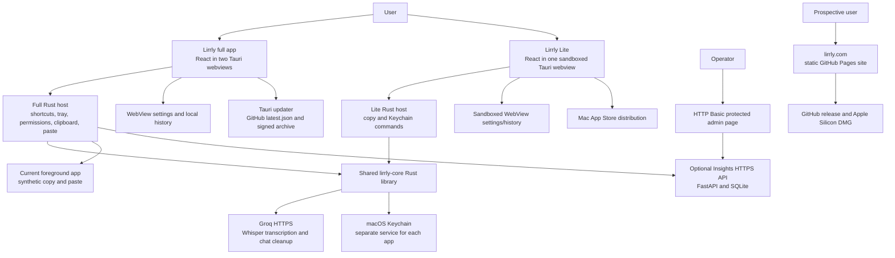

# Lirrly — complete project architecture

Canonical architecture for the **whole project**, first reviewed against the workspace on **2026-09-12**, re-verified against source on **2026-09-13**, and updated on **2026-09-14** after two rounds of repairs landed (audit A01, A05, A17, A32, then A02, A07, A09, A10, A22, A29, A33 and the transport half of A11). Product source baseline: local branch `lirrly`, commit `4d22d13`; public `origin/main` observed at `ae3b9bad`. Architecture maintenance added during that audit is still a local, uncommitted change. External observations below are dated snapshots, not permanent status guarantees.

This document describes what exists, including defects and boundaries. It does not certify that the app is ready to launch. The companion assessment is [FULL-AUDIT-2026-09-12.md](FULL-AUDIT-2026-09-12.md).

## Reading map

1. §1 Product/system map and distribution boundaries
2. §2 Repository, runtime, and dependency structure
3. §3 Full app: startup, onboarding, settings, recording, transforms, paste, history
4. §4 Lite: single-window journey and App Store boundary
5. §5 Shared core: provider calls, prompts, Keychain, failure behavior
6. §6 Data, events, commands, permissions, and external traffic
7. §7 Insights administration and operations
8. §8 Website, distribution, releases, and updates
9. §9 Licensing and commercial architecture
10. §10 Verification and launch boundaries
11. §11 How to keep this file accurate
12. Generated versions, native commands, and complete source/configuration index

## 1. System at a glance

Lirrly is a macOS speech-to-text product with **two desktop applications**, **one shared Rust library**, **a static marketing website**, and **an optional diagnostics/feedback service**. The deployed speech/cleanup engine is **Groq cloud batch inference**. There is no implemented offline/local model, live incremental transcription engine, customer cloud account system, payment service, or subscription enforcement.



Arrows show intended application calls. The `Full → Native` transcription edge was broken by an IPC argument-name mismatch until 2026-09-14 (audit A01); the payload key is now correct in both apps and a repository-wide contract check enforces it (§11). A diagram arrow is still not evidence of successful native end-to-end execution — the repaired path has been proven in tests, not yet in a signed build against a real microphone.

| Component | Location | Responsibility | Current boundary |
|---|---|---|---|
| Full app 0.4.1 | `lirrly/` | Dictation anywhere, FlowBar, transforms, dictionary/snippets, history, updater | Direct distribution; uses Accessibility/private macOS window support; not sandboxed for MAS |
| Lite 1.0.1 | `lirrly-lite/` | Dictate/edit/transform/copy within its own window | Separate sandboxed MAS app; proprietary source kept out of public clean cut |
| Core 0.1.0 | `crates/lirrly-core/` | Groq multipart/audio and chat requests, shared prompts, Keychain abstraction | Rust library compiled into both binaries; no independent server |
| Insights | `insights/` | Opt-in error reports, manual feedback, basic admin dashboard | Private FastAPI service; independent from inference; full app only |
| Website | `site/` | Marketing, downloads, privacy page, install command | Static files served through GitHub Pages/custom domain |
| Release tooling | `scripts/`, private `signing/` | Build/sign/notarize/package/upload and update tap | Local Mac tooling with external publishing side effects |

## 2. Repository and build structure

The root is not a JavaScript monorepo workspace or Cargo workspace. There are **two separate npm packages and three separate Cargo crates/lockfiles**. Both desktop crates reference `../../crates/lirrly-core` via a path dependency. Run checks from each actual package/crate directory; checking the full Rust application alone does not execute the dependency crate's unit tests.

- `lirrly/src/main.tsx` chooses Settings or FlowBar from the Tauri window label; `?view=` supports browser previews.
- `lirrly/src/settings/` contains the large Settings/Hub page and its visual helpers/styles.
- `lirrly/src/flowbar/` owns the recording state machine, floating controls, waveform, error messages, and global dictation/transform listeners.
- `lirrly/src/onboarding/` contains first-run setup and its styling.
- `lirrly/src/lib/` contains audio capture, inference orchestration, settings/history, shortcut formatting, diagnostics, and updater clients.
- `lirrly/src-tauri/src/main.rs` enters `lirrly_lib::run()`; `lib.rs` owns native commands, windows, tray, shortcuts, native state, paste, and diagnostics transport.
- `lirrly-lite/src/App.tsx` owns most Lite UI/recording orchestration; `audio.ts`, `store.ts`, `Waveform.tsx`, and `styles.css` provide its support layers.
- `lirrly-lite/src-tauri/src/lib.rs` registers only Lite's provider/key commands and clipboard/opener/store plugins.
- `crates/lirrly-core/src/groq.rs` implements provider calls and shared prompts. `keychain.rs` scopes credential storage. `lib.rs` exports the library API.
- `insights/app.py` includes schemas, SQL, HTTP routes, authorization, and server-rendered HTML. There is no separate admin frontend bundle.
- `site/index.html`, `main.js`, `styles.css`, `privacy.html`, `robots.txt`, `llms.txt`, and `CNAME` are served directly without a build step.
- `docs/adr/001` through `005` record stack, full-app distribution, planned local/streaming work, licensing, and Lite distribution decisions. ADR-003 is a plan, not installed functionality.
- `docs/RELEASE.md` is the release runbook; `docs/appstore/` is private listing/submission documentation.
- `docs/screenshots/`, `appstore-screenshots/`, desktop `icons/`, and `site/img/` contain existing assets. `site/fonts/` contains self-hosted fonts. These are not runtime services.
- `design/`, root `HANDOFF-*`, `PARITY-PLAN.md`, and `WISPR-CLONE-BLUEPRINT.md` are historical/reference material. They must not override current code evidence.
- `.context/` holds audit evidence and collaboration scratch files; `handoffs/` and `MASTER-HANDOFF.md` retain local history. `signing/` holds private operational scripts and credentials and must remain excluded from publication.

Both apps use React 19, TypeScript, Vite 7, Tauri 2, Rust 2021, and the OS WebView. Full app adds global-shortcut, autostart, notification, process/relaunch, updater, clipboard-manager, opener, and store plugins; Lite registers only opener, clipboard-manager, and store. Core uses reqwest/rustls, serde_json, base64, and keyring's Apple backend. `enigo` is a full-app dependency for synthetic keys. Version ranges are resolved by each lockfile; the generated source index includes lockfiles so dependency changes trigger a review.

## 3. Full app runtime

### Startup, windows, and tray

Tauri config creates a main Hub window (1180×760; minimum 860×540) and a transparent, non-focused, always-on-top FlowBar window. The Rust host uses macOS accessory activation policy, so this is a menu-bar resident application. Closing the main window hides it; Quit in the tray exits the process. The FlowBar is positioned bottom-center against a monitor's full size and position (not its work area) and resized through native commands.

Native state includes:

- `ShortcutRegistry`: mutex-protected action→accelerator mappings.
- `PasteLock`: Tokio mutex shared by synthetic selection copy and paste operations; contention returns a busy error.
- `LastTranscript`: last output submitted to paste (including transforms), recorded before paste succeeds; memory-only.
- `PasteMenuItemHandle`: enables the tray's last-transcript item after a paste.

Default global shortcuts are Command+Shift+D for dictation and Option+T for transform. The frontend reapplies saved shortcuts. **Neither registration is fatal:** until 2026-09-14 the dictation binding propagated its error out of `setup`, so another app holding ⌘⇧D aborted the launch entirely and left no way to reach Settings and rebind. Both now log and degrade — the FlowBar record button and the tray still work. Rebinding tries to preserve the old mapping on conflicts. No hold-to-talk implementation exists.

Tray Home/Shortcuts navigate the Hub. Tray language items open settings rather than setting a language directly. Tray Check for updates opens GitHub Releases; the actual in-app updater lives in Settings→Account. Help/support/feedback tray actions open GitHub issues.

### Onboarding and settings

The five-step wizard runs Welcome → Permissions → Engine/API key → First dictation → Done. Shortcut configuration is in the Hub, not a separate wizard step. The key-entry UI temporarily holds the typed key in WebView memory and sends it to Rust for Keychain storage. Existing keys are never returned to the WebView by a get-key command. Key validation currently depends on a chat request, so provider/model availability and key validity are coupled.

The Hub exposes Home, History, Insights, Dictionary, Snippets, Transforms, Styles, Scratchpad, Shortcuts, Settings, and Account. **Hub Insights** means local personal usage statistics; it is separate from the operator's **Insights server**. Scratchpad/command mode and local-provider UI are not completed execution paths.

`AppSettings` includes provider/model/language, per-context cleanup levels, dictionary, snippets, transform library/active transform, FlowBar visibility/opacity, chosen microphone, autostart, display name, history preference, analytics consent, notification preferences, and shortcut mappings. Defaults: Groq, `whisper-large-v3-turbo`, auto language, history on, analytics off, AI cleanup enabled, personal context light cleanup. The live pipeline uses personal context by default; per-app automatic context detection is not implemented.

Settings are persisted in WebView localStorage (`lirrly.settings`). Legacy `murmur.settings` is supported for migration. A `settings-changed` Tauri event coordinates reloading between windows. Writes are not transactional across windows. Once the Keychain write is confirmed, `purgeStoredApiKey()` deletes the credential from **every** namespace the app has written; before 2026-09-14 only the current one was blanked, so upgraded installs kept a readable key in `murmur.settings` indefinitely.

### Recording and transcription

Intended sequence:

1. FlowBar receives the dictation shortcut, or a user clicks its record control.
2. `startRecording()` requests microphone access, optionally for `selectedMicId`, chooses a supported MediaRecorder MIME, creates an AudioContext/analyser, and accumulates chunks in memory.
3. UI changes from idle to listening and displays the live waveform. A five-minute timer stops recording.
4. Stop resolves a Blob, stops tracks/closes capture resources, and changes UI to processing.
5. `engine.ts` base64-encodes the complete Blob. Up to 60 dictionary words become the Whisper prompt hint.
6. Frontend invokes native `transcribe`; Rust loads the key and calls the shared Groq client.
7. The returned text undergoes deterministic cleanup, optional AI cleanup for medium/high levels, then snippet expansion.
8. Final text is written to history when enabled and sent to `paste_text`. Completion drives Home refresh/onboarding celebration. Failure is mapped to a FlowBar error and an opt-in diagnostic report.

This is **batch capture → batch upload**, not streaming. MediaRecorder chunk events do not mean server streaming. No durable audio spool, retry queue, raw/final transcript pair, request cancellation, provider fallback, or exactly-once insertion record is implemented.

**IPC contract (was the blocker for step 6).** `#[tauri::command]` in Tauri 2 defaults to `rename_all = "camelCase"`, so the generated dispatcher looks up the payload key `audioB64`. Until 2026-09-14 `engine.ts` sent `audio_b64`; because Tauri resolves argument keys by exact match with no snake_case fallback, every dictation failed with `command transcribe missing required key audioB64` before the Keychain or Groq was touched. The mismatch existed in the first prototype commit (`40e8235`) and in every revision since, including the published `main` and the `v0.4.1` tag — so no released full-app build could dictate. `engine.ts` now sends `audioB64`, matching Lite and every other command. Two guards prevent recurrence: a unit test asserting the serialized payload keys (helper-level tests cannot see this boundary), and `scripts/architecture.py --check`, which compares every literal `invoke()` payload in both apps against the Rust signature it targets and fails on an unexpected or missing key.

**Microphone ownership.** `startListening` claims synchronously before awaiting `getUserMedia`, so two fast shortcut presses cannot each open a device; a start that loses the race disposes its recorder rather than stranding it. `Recorder` owns its resources: `stop()` is idempotent, `dispose()` releases without producing audio, and every exit path — setup failure, recorder error, an inactive `stop()` that throws, unmount — runs the same release. Until 2026-09-14 none of this existed and an abandoned recorder left the microphone live.

**Recovery.** The captured audio is retained in `pendingTakeRef` until the text is delivered, so a network failure, a 429 or a truncated response costs a click on **Retry** rather than the take. Delivery is one function shared by the first attempt and the retry, so they cannot drift. A failed history write is reported but never blocks delivery. The take is dropped on success, when a new recording starts, when the toast expires, and for errors a retry cannot fix (bad key, oversized recording) — so nothing is held that the user has no way to reach.

**Still open on this path:** A04 (history read-modify-write races), A06 (no `finish_reason` check) and A08 (no destination pinning across the network wait).

### Cleanup, snippets, and transforms

Deterministic cleanup trims whitespace, removes a small English filler-word list, strips stray leading separators, and capitalizes a leading lowercase letter. Medium/high levels optionally call Groq cleanup; errors silently return deterministic text.

Until 2026-09-14 the leading strip was `^[^\wÀ-ɏ؀-ۿ]+` — it admitted only ASCII word characters, Latin-1/Latin-Extended-A and Arabic, and deleted everything else. Devanagari `नमस्ते दुनिया` and Han `你好世界` reduced to the empty string, a leading emoji was deleted, and `-5 degrees` became `5 degrees`. Hindi is an offered transcription language, so this destroyed a language the app advertises. It is now an explicit separator class (`[\s,.;:!?…،؛۔]`), so letters in any script, digits, signs, quotes, brackets, currency and emoji all survive; capitalization is gated on `\p{Ll}` so caseless scripts pass through byte-identical. Filler removal is additionally skipped when the configured language is explicitly non-English, because `um` is an ordinary German word. Auto-detect still applies the English list — the residual known limitation.

The dictionary is a recognition hint, not automatic correction learning. Snippet expansion uses one combined regular expression. It used ASCII `\b` boundaries until 2026-09-14, which meant an Arabic trigger could never match — the required boundary does not exist between two Arabic letters — and neither could a trigger ending in punctuation such as `C++`. Boundaries are now Unicode-aware (`[^\p{L}\p{N}_]` with a lookahead; the preceding character is captured and re-emitted rather than using lookbehind, which macOS 12's WebKit lacks). There is still no recursive snippet expansion — expansion remains deliberately single-pass.

Transforms have built-ins (rewrite, summarize, formal, grammar, translate) plus custom CRUD and one active transform. Option+T captures the current selection using a clipboard sentinel and synthetic Command+C, calls Groq, then pastes the result. History's transform action transforms and copies an existing entry. The built-in full-app translate prompt has no explicit destination choice; Lite instead offers a specific English target.

No transformation preview/diff/undo ledger exists. Foreground app identity, target field, and selection are not pinned across the network wait, so switching apps can send the result to a different target.

### Paste and clipboard behavior

The native paste helper reads prior **text** clipboard content, writes the generated text, checks Accessibility, emits Command+V via enigo, waits briefly, and restores prior text when a nonempty text snapshot exists. A shared try-lock serializes clipboard operations. The command updates the last-transcript state/menu before attempting paste; availability in that menu is not proof of insertion.

**Order matters here.** Until 2026-09-14 the Accessibility check ran *before* the clipboard write and returned early, so a user who declined the permission got a successful transcription and then lost it completely — while onboarding promised they could paste it with ⌘V. The write now happens first and the transcript is deliberately **not** restored away; that path returns `accessibility_not_granted_copied`, which both the dictation and transform flows treat as a completed operation needing one keystroke, surfaced as “Copied — press ⌘V to paste”. The same applies if the permission is revoked mid-flight.

This is synthetic input, not an acknowledged editor API. Success means the key events were sent; it does not prove that the correct field accepted text. Rich clipboard payloads (images/files/formatting), every failure/empty-clipboard branch, and a user's changing clipboard during the delay are not fully preserved. A changed focus/selection is not detected. These boundaries matter to the product promise of dependable dictation anywhere.

### History and statistics

Production history uses Tauri store at the app-data `history.json`, under `items` and `lifetime_count`; the collection is capped at 200 entries during append. Entries contain final text, timestamp, optional duration, and optional app/WPM/style fields. Browser previews fall back to localStorage. Legacy histories are migrated on first store use. The file is local plaintext, not encrypted; a WebView with store permissions can access it.

Home/Insights derive word counts, local-date buckets, duration/WPM, and streaks from capped retained history. FlowBar milestone toasts use the separate lifetime count. A separate local lifetime count can survive history clearing. Turning off future history storage is distinct from erasing existing history. Delete/write operations use client-side read/modify/write, so stale views or simultaneous writes can lose newer items. There is no DB transaction or native authoritative mutation layer.

## 4. Lirrly Lite

Lite is a separate application, not a configuration switch for the full binary. It has its own npm/Cargo packages, app ID, Keychain service, sandbox container, signing profile, permissions, version, and distribution process. This separation avoids Tauri configuration overrides mutating the full app's Cargo private-API features.

Single-window journey: Settings/key setup → choose language and optional transform → click record or press Space → waveform and elapsed capture → stop → Groq transcription → cleanup → optional selected transform → editable text area → Copy. History stores up to 100 local entries. Settings/history are WebView localStorage, not the full app's history.json, even though the store plugin is registered.

Lite uses the correct `audioB64` IPC argument. Speech model is `whisper-large-v3-turbo`; chat model is hardcoded `qwen/qwen3.8-27b`. There is no selectable provider/model or live key validation. Copy uses only clipboard write permission and does not simulate paste into other apps.

Sandbox entitlements permit audio input and outgoing network connections, with MAS team/application identifiers in the production entitlement file. `macOSPrivateApi` is false; global shortcuts, Accessibility, enigo, tray, diagnostics, autostart, and self-updater are absent. Production bundles embed the provisioning profile from private signing storage. A local-test config exists; MAS and local-test signatures/entitlements are not interchangeable acceptance evidence.

Current lifecycle limits: pending microphone acquisition is not locked; text can be edited/cleared while a delayed result later replaces it; opening Settings can hide recording status and errors; failed requests do not retain audio for retry; persisted data is weakly validated. `VITE_SCREENSHOT_TEXT`/language are build-time preview inputs and must be absent from shipping builds. Existing transcript screenshots are seeded demonstrations, not recorded-speech accuracy evidence.

**Apple snapshot, 2026-09-14:** Lite 1.0.1 spent nine days in `WAITING_FOR_REVIEW` without entering review. Because `releaseType` was `AFTER_APPROVAL`, approval would have published automatically and unrecallably with the Lite defects below still present. The submission was therefore **withdrawn** on 2026-09-14 (`reviewSubmissions` canceled → `COMPLETE`; the version is now `DEVELOPER_REJECTED`), and `releaseType` was changed to **`MANUAL`** so a future approval waits for a deliberate release. The 1.0.1 build remains `VALID` and attached; resubmission does not require a new upload unless the binary changes. Nothing is pending at Apple right now.

## 5. Shared core/provider boundary

`lirrly-core` is compiled into both apps. It does not contain macOS Accessibility/global-input code, a local speech model, or a server process.

| Call | Input | External request | Output/failure |
|---|---|---|---|
| `transcribe` | Key, base64 clip, MIME, model, optional language/hint | Multipart POST `https://api.groq.com/openai/v1/audio/transcriptions` | Parsed text string; raw provider error on failure |
| `cleanup_text` | Key, transcript, model, level, language/context | Chat completion with shared system prompt | Edited string; callers may fall back silently |
| `transform_text` | Key, source text, instruction, model, language | Chat completion | Rewritten string; errors propagated |
| Keychain `has/set/load` | App service and typed key | OS Keychain APIs | Presence boolean, save/delete, private key loading in Rust |

The client normalizes audio MIME codec parameters, assigns an upload filename extension, and rejects decoded recordings above **25 MiB**. Each HTTP client has a 60-second timeout. Requests are independent rather than queued/retried/backed off. Token budgets are fixed (cleanup 900; transform 1200); chat parsing takes content without checking `finish_reason`, so a valid but length-truncated completion is treated as successful text.

The shared prompt asks to preserve meaning and adds an explicit dialect-preservation instruction when language is Arabic. Auto-detect does not receive the same explicit Arabic branch. Shared prompt reuse reduces duplication but does not by itself establish language accuracy or preservation of names, numbers, negation, and mixed-language speech.

The default chat model appears in multiple frontend/native places despite shared core extraction. Retired model migration is a static list; it does not automatically detect future retirement. **Read-only Groq models check on 2026-09-12 confirmed both Whisper choices and `qwen/qwen3.8-27b` were available to the tested account.** No audio/chat inference benchmark was performed in this audit.

Keychain account label is `groq-api-key`; the service names are `com.mshrmnsr.lirrly` and `com.mshrmnsr.lirrly-lite`. The key is sent as an Authorization credential to Groq. “Stored in Keychain” does not mean it never leaves the Mac during use.

## 6. Data, trust, and event contracts

| Data | Where it exists | Leaves the Mac? | Retention/control |
|---|---|---|---|
| Microphone audio | MediaRecorder chunks, Blob/base64, Rust decoded bytes | Yes, to Groq when submitted | No intentional local audio archive; no durable recovery buffer |
| Raw and cleaned text | WebView and Rust memory; final local history | Yes, transcripts/instructions go to chat cleanup/transforms | Raw transcript not separately retained as recovery copy |
| API key | Typed UI state temporarily; macOS Keychain persistently | Yes, only in Groq request authorization through intended provider path | UI can save/clear; legacy migration needs correction |
| Settings | App-specific WebView localStorage | No settings-sync backend | Stored locally; full app has partial validation/migration |
| Full history | Local app-data history.json; fallback/legacy localStorage | Not intentionally sent to Insights; selected text can go to Groq | 200-entry append cap; history toggle and clear differ |
| Lite history | Sandbox WebView localStorage | Not uploaded as a collection | 100-entry cap; validation/recovery incomplete |
| Diagnostic report | Full WebView → Rust → Insights SQLite | Opt-in | Stable random install ID plus a sanitized error summary (provider bodies reduced to status + error code; key- and email-shaped text stripped client-side and again at ingest; 300 chars); server deletes after 180 days |
| User feedback/email | Full Settings → Rust → Insights SQLite | Deliberate submit action | Same stable ID links to reports (pseudonymous, as the privacy page states; 0.4.2's Settings label still says "anonymous" — corrected in the next release); server deletes after 365 days; `POST /admin/erase` wipes one ID on request |
| Update metadata/artifact | Full app/Tauri updater and GitHub | Checks/downloads contact GitHub | Installer action is user initiated |

CSP restricts the WebView network surface to Tauri IPC, self/asset content, local fonts, and media blobs. Provider and telemetry networking runs in Rust, beyond WebView `connect-src`. Capabilities scope plugins per window; app-defined commands registered in the handler need their own authorization consideration and are not automatically made window-private by a minimal plugin capability list.

| Event | Producer → consumer | Payload/meaning |
|---|---|---|
| `toggle-dictation` | Native shortcut → FlowBar | No data; toggle capture |
| `run-transform` | Native shortcut → FlowBar | No data; capture/transform current selection |
| `settings-changed` | Settings/FlowBar → other windows | Notification only; reread persisted settings |
| `navigate-settings` | Native tray or FlowBar → Settings | Section string |
| `dictation-complete` | FlowBar → Home/onboarding | Notification only; refresh history/celebration; not target-editor acknowledgement |

The command list and Rust argument declarations are generated at the end of this file. JavaScript invoke argument names default to camelCase; tests must cover this serialization boundary, not just helper functions.

## 7. Insights API and admin

Deployed chain: `insights.lirrly.com` HTTPS → Caddy reverse proxy (site config `/etc/caddy/lirrly-insights.caddy`; no `log` directive, so no Caddy access log) → loopback uvicorn port 8787 (`--no-access-log`) → FastAPI → SQLite. Since 2026-09-17 the systemd unit runs a dedicated `insights` system user (not root) with `ProtectSystem=strict` + `ReadWritePaths=/opt/lirrly-insights`, empty capability set, a memory cap, and a start-limit so a deliberate config-refusal cannot restart-loop. Startup validation lives in the FastAPI lifespan, so **every** run mode — including uvicorn — refuses to start without the admin password and proves the database writable before serving.

Routes:

- `POST /v1/report`: bounded Pydantic error-event schema; `kind` outside {error, crash} is coerced to `error`; signature/message/context pass a server-side scrub (key-, Bearer- and email-shaped text replaced) before storage.
- `POST /v1/feedback`: bounded user message (key/Bearer shapes scrubbed; deliberate prose otherwise kept), optional email/rating, plus install/app/OS metadata.
- `GET /health`: **readiness** — performs a real SQLite write and returns 503 if it fails. `GET /live`: liveness only.
- `GET /admin`: HTTP Basic protection; escaped HTML shows error-report aggregates, feedback, the DB size and the retention policy. Its active-install count covers installations that reported errors, not all active users.
- `POST /admin/erase?install_id=…`: Basic auth; deletes every event and feedback row for one install id and returns the counts. This is the deletion channel the privacy policy points at.

The database has `events` and `feedback` tables, indexes on signature/time/install id. Retention is enforced by the app itself (events 180 days, feedback 365 days; purge at startup and hourly, piggybacked on ingest). SQL uses bound parameters; admin user content is escaped. Rate limiting (60/minute) keys buckets by a **salted hash** of the client address (X-Forwarded-For trusted only when the peer is loopback, i.e. Caddy) — memory-only, bounded map, salt regenerated each restart, so no address is stored or derivable. Request bodies over 32 KB are rejected by the app (Caddy budget on top). A malicious client can still fabricate reports — ingest is deliberately unauthenticated. There is no native crash-dump ingestion/symbolication, alerts, or ticket workflow. `insights/test_app.py` (10 tests, run on macserver) includes negative privacy tests that post keys/emails and read the database to prove they were not stored, plus erase/retention/health/rate-limit coverage; `requirements.txt` is pinned to the tested versions. `insights/README.md` carries the operational runbook: erase-by-id, daily backup cron keeping 14, restore drill, and the logging-chain checklist.

Full client reporting is off by default. `reportError` checks `shareAnalytics`, sends a stable install ID and an error summary, and suppresses reporting failures. Since 2026-09-14 that summary passes through `sanitizeReport()`: a provider failure — which arrives as the raw HTTP response body and can echo request content — is reduced to its status and the provider's own error code, and credential- and email-shaped text is redacted from everything else. `sendFeedback` is intentional user submission and can attach an email; only key-shaped text is stripped from it, because the prose is the point.

Transport sanitizing (2026-09-14) plus the server-side scrub, retention, erase channel and honest pseudonymity wording (2026-09-17) close both halves of audit A11 and address A24–A28. The privacy page and this document describe the install ID as pseudonymous, with the retention numbers, because feedback linking is what makes deletion requests satisfiable. In 0.4.2 the Settings toggle still reads "Send anonymous crash reports" and the app does not display the ID (in-app feedback carries it automatically); the next release relabels the toggle and shows the ID.

**Live verification (2026-09-17, on the VPS):** deployed from this source; process runs as `insights`; `/health` 200 (write probe) locally and publicly; a planted `gsk_…` key + email in a real `POST /v1/report` was stored as `key [key] owner [email]`; `POST /admin/erase` removed the probe row; a 70 KB body got 413 from Caddy; journald shows startup lines only; the daily backup cron ran and its output passed `PRAGMA integrity_check`. Deploy gotcha: a venv is not relocatable — build it at its final path, or every shebang points at the dead one (`status=203/EXEC`).

## 8. Website, distribution, and updates

The website uses static HTML/CSS/JavaScript, self-hosted fonts, existing app screenshots/GIFs, animated examples, dark mode, responsive layouts, and reduced-motion handling. The demo animation is illustrative; it is not a live connection to the desktop app. `site/CNAME` names lirrly.com; the Pages workflow uploads the directory directly.

Scroll-reveal content is **visible by default**; `main.js` adds `.js-reveal` to the document element as its first act, and only that class enables the hide-then-reveal styling. Before 2026-09-14 the hiding was unconditional, so disabled or failed JavaScript rendered the page with every heading at `opacity: 0`.

Marketing, onboarding, README, `llms.txt` and the privacy page were reconciled with actual behaviour on 2026-09-14 (audit A29). The claims “no Lirrly server”, “no telemetry”, “nothing phoning home”, “nothing leaves this Mac except the audio”, “your key never leaves this Mac” and an “export” affordance that was never built are all gone. The accurate position — no account, no Lirrly service in the dictation path, diagnostics opt-in and off by default, the key sent only to Groq — is what is now published.

The full application currently distributes an Apple Silicon DMG via GitHub Releases and a separate Homebrew tap (`m55h11r11/homebrew-lirrly`). The config minimum is macOS 12.0; only an aarch64 release was verified. An Intel/macOS-version compatibility matrix has not been demonstrated. Do not imply all Macs are supported from the OS minimum alone.

Full updater flow: Mounting Settings→Account quietly checks GitHub's latest release `latest.json`; the Tauri plugin selects a platform archive; on user request it downloads the archive, verifies its update signature, and installs it. Restart is explicit. The signature authenticates the **archive**, not a separately signed JSON manifest. Metadata/URLs still rely on the HTTPS/release service; the old “signed manifest” wording overstates the mechanism.

`release.sh`: clean-tree check → version changes across every version-bearing file (with an equality assertion) → frontend, full-Rust, core-crate and architecture/IPC gates → signed/notarized bundle → trust checks → local commit/tag → **public-source provenance gate** → GitHub release assets targeted at that public commit → Homebrew cask update. Private signing material stays outside source. Staging is an explicit file list rather than `git add -A`, which had previously swept automation droppings — including a live API key — into the index.

Until 2026-09-14 the script published with `--target main` before the separate clean public-source update, which allowed a release tag to point at older source. **Observed on 2026-09-12 and still true of the live artifact: the public v0.4.1 tag resolves to source with package version 0.4.0.** The script can no longer create that state, but the existing v0.4.1 tag is still wrong and is unresolved (audit A12). A signed binary is not evidence that its release source tag is correct.

`release-lite.sh` builds the separate Lite package, checks its sandbox/signature/profile, creates an installer package, and optionally uses Transporter to upload. Upload/processing is separate from App Review submission and approval. There is no automated release-approval tracker in this repo.

Local branch `lirrly` contains development history plus proprietary/private code. Public `main` is a curated clean cut; **do not push this local branch or its full history publicly**. Preserving that boundary is separate from tracking this architecture locally. This document and the new guard contain no credentials and can be reviewed for inclusion in the clean public tree; private operational audit evidence stays local.

## 9. Licensing and commercial architecture

Root/full/core code declares AGPL-3.0-only. Lite has a separate proprietary license. ADR-004 and CONTRIBUTING.md record an intended dual-licensing/open-core strategy and contributor relicensing grant. The project does not implement license keys, entitlements, subscriptions, receipts, billing, purchase restoration, cloud quotas, customers, or a paid backend.

Proprietary distribution of shared code requires control of the relevant rights and compatible third-party licenses; the mere location of code in a private directory does not settle legal obligations. Preserve dependency notices and contributor provenance, and have the actual commercial terms reviewed before monetization. This is an architecture description, not a legal determination.

## 10. Verification and launch boundaries

The audit ran full-app frontend build/lint/tests (40 at audit time, **52** after the 2026-09-14 regression tests); full Rust fmt/clippy/6 tests; core 3 tests; Lite frontend build and native checks/tests; isolated negative-path probes; public read-only checks; and Apple/Groq read-only API checks. See the dated audit for precise results and limitations. Existing helper tests do not cover native dictation IPC, real editor insertion, permissions/revocation, lost-draft races, full VoiceOver navigation, or actual Arabic transcription accuracy.

Existing public CI builds/lints/tests only full frontend and checks/fmts/clippies only full Rust. It lacks the broad product coverage needed for release. This audit adds a documentation-drift job; it does **not** fix those product-test omissions or the reported runtime defects. The architecture job runs after a future commit/push; no remote workflow or deployment was changed during the audit.

Must distinguish:

- compiled vs launched;
- isolated/mocked reproduction vs native end-to-end behavior;
- uploaded/VALID vs Apple-approved/available;
- downloadable/signed vs source-reproducible/reliable;
- a reachable health endpoint vs healthy database/ingest/backups;
- planned local streaming vs current Groq batch processing.

## 11. Keeping this file accurate

This is the single complete architecture document. Keep dated audits as historical evidence, not competing permanent architecture maps. `AGENTS.md` requires future work to update this file in the same change.

`--check` additionally enforces the **IPC contract**: it parses every `#[tauri::command]` signature in both apps, applies Tauri's camelCase renaming, and compares that against the keys of every literal `invoke()` payload in the frontends, failing on an unexpected or missing non-optional key. Call sites whose arguments come from a variable are skipped as not statically checkable. This is the guard for audit A01, and it was verified to fail on three separate injected regressions before being trusted.

```bash
# Rebuild source-derived versions, command inventory, and file map only:
python3 scripts/architecture.py --refresh
# After reviewing/updating the explanatory sections against changed source:
python3 scripts/architecture.py --reviewed
# Fail if files were added/deleted/changed since that review or inventory drifted:
python3 scripts/architecture.py --check
# Public clean-cut CI checks only its published source subset:
python3 scripts/architecture.py --check --scope public
```

The reviewed source hashes are embedded in this same file. Refreshing facts alone does not mark prose reviewed. Public-only checkouts must not regenerate the full inventory. The tracked architecture and guard must be included together in any future curated public-source update. No automation can prove every explanatory sentence semantically correct; the combination of generated facts, a failing drift check, and a required code/doc review prevents stale architecture from being silently treated as current. External status must be queried again when needed; it is not monitored continuously.

Source additions in the known component roots are detected. New top-level runtime components must also be added to the guard's scope and this document. Binary assets, secret directories, user storage, and build output are deliberately excluded. Image creation/editing remains restricted to the built-in image generation tool by AGENTS.md.

<!-- architecture:generated:start -->

## Source-derived inventory

Generated by `python3 scripts/architecture.py --refresh`. This section describes files on disk, not deployed acceptance.

| Product | Package version | Bundle identifier | Windows |
|---|---|---|---|
| Lirrly | 0.4.2 | `com.mshrmnsr.lirrly` | main, flowbar |
| Lirrly Lite | 1.0.1 | `com.mshrmnsr.lirrly-lite` | main |

### Native commands

Argument names below are the Rust declarations; Tauri's default JavaScript wire keys are camelCase. `--check` verifies every literal `invoke()` payload against these signatures.

**lirrly** (17 commands)

- `has_api_key()`
- `set_api_key(key: String)`
- `check_accessibility()`
- `request_accessibility()`
- `open_privacy_pane(app: AppHandle, pane: String)`
- `transcribe(audio_b64: String, mime: String, model: String, language: Option<String>, prompt: Option<String>)`
- `cleanup_text(text: String, model: String, level: String, language: Option<String>, context: Option<String>)`
- `transform_text(text: String, prompt: String, model: String, language: Option<String>)`
- `capture_selection(app: AppHandle)`
- `report_event(enabled: bool, install_id: String, kind: String, signature: Option<String>, message: Option<String>, context: Option<String>)`
- `send_feedback(install_id: String, message: String, email: Option<String>, rating: Option<u8>)`
- `update_shortcut(app: AppHandle, action: String, accelerator: String)`
- `paste_text(app: AppHandle, text: String)`
- `show_flowbar(app: AppHandle)`
- `hide_flowbar(app: AppHandle)`
- `resize_flowbar(app: AppHandle, width: f64, height: f64)`
- `open_settings(app: AppHandle)`

**lirrly-lite** (5 commands)

- `has_api_key()`
- `set_api_key(key: String)`
- `transcribe(audio_b64: String, mime: String, model: String, language: Option<String>)`
- `cleanup_text(text: String, model: String, level: String, language: Option<String>)`
- `transform_text(text: String, prompt: String, model: String, language: Option<String>)`

### Maintained source and configuration map

All paths below participate in the drift check. Images/fonts are inventoried by directory in the prose; their binary contents are excluded.

- [.github/workflows/ci.yml](.github/workflows/ci.yml)
- [.github/workflows/site.yml](.github/workflows/site.yml)
- [.gitignore](.gitignore)
- [AGENTS.md](AGENTS.md)
- [CONTRIBUTING.md](CONTRIBUTING.md)
- [LICENSE](LICENSE)
- [crates/lirrly-core/.cargo/config.toml](crates/lirrly-core/.cargo/config.toml)
- [crates/lirrly-core/Cargo.lock](crates/lirrly-core/Cargo.lock)
- [crates/lirrly-core/Cargo.toml](crates/lirrly-core/Cargo.toml)
- [crates/lirrly-core/src/groq.rs](crates/lirrly-core/src/groq.rs)
- [crates/lirrly-core/src/keychain.rs](crates/lirrly-core/src/keychain.rs)
- [crates/lirrly-core/src/lib.rs](crates/lirrly-core/src/lib.rs)
- [docs/RELEASE.md](docs/RELEASE.md)
- [docs/adr/001-stack-tauri.md](docs/adr/001-stack-tauri.md)
- [docs/adr/002-distribution-developer-id-not-mas.md](docs/adr/002-distribution-developer-id-not-mas.md)
- [docs/adr/003-local-streaming-engine.md](docs/adr/003-local-streaming-engine.md)
- [docs/adr/004-licensing-agpl-and-monetization.md](docs/adr/004-licensing-agpl-and-monetization.md)
- [docs/adr/005-mac-app-store-lite.md](docs/adr/005-mac-app-store-lite.md)
- [docs/appstore/lirrly-lite-metadata.md](docs/appstore/lirrly-lite-metadata.md)
- [insights/README.md](insights/README.md)
- [insights/app.py](insights/app.py)
- [insights/lirrly-insights.service](insights/lirrly-insights.service)
- [insights/requirements.txt](insights/requirements.txt)
- [lirrly-lite/LICENSE.md](lirrly-lite/LICENSE.md)
- [lirrly-lite/README.md](lirrly-lite/README.md)
- [lirrly-lite/index.html](lirrly-lite/index.html)
- [lirrly-lite/package-lock.json](lirrly-lite/package-lock.json)
- [lirrly-lite/package.json](lirrly-lite/package.json)
- [lirrly-lite/src-tauri/.cargo/config.toml](lirrly-lite/src-tauri/.cargo/config.toml)
- [lirrly-lite/src-tauri/Cargo.lock](lirrly-lite/src-tauri/Cargo.lock)
- [lirrly-lite/src-tauri/Cargo.toml](lirrly-lite/src-tauri/Cargo.toml)
- [lirrly-lite/src-tauri/Info.plist](lirrly-lite/src-tauri/Info.plist)
- [lirrly-lite/src-tauri/LirrlyLite.entitlements](lirrly-lite/src-tauri/LirrlyLite.entitlements)
- [lirrly-lite/src-tauri/LirrlyLiteLocal.entitlements](lirrly-lite/src-tauri/LirrlyLiteLocal.entitlements)
- [lirrly-lite/src-tauri/build.rs](lirrly-lite/src-tauri/build.rs)
- [lirrly-lite/src-tauri/capabilities/default.json](lirrly-lite/src-tauri/capabilities/default.json)
- [lirrly-lite/src-tauri/src/lib.rs](lirrly-lite/src-tauri/src/lib.rs)
- [lirrly-lite/src-tauri/src/main.rs](lirrly-lite/src-tauri/src/main.rs)
- [lirrly-lite/src-tauri/tauri.conf.json](lirrly-lite/src-tauri/tauri.conf.json)
- [lirrly-lite/src-tauri/tauri.localtest.conf.json](lirrly-lite/src-tauri/tauri.localtest.conf.json)
- [lirrly-lite/src-tauri/tauri.screenshots.conf.json](lirrly-lite/src-tauri/tauri.screenshots.conf.json)
- [lirrly-lite/src/App.tsx](lirrly-lite/src/App.tsx)
- [lirrly-lite/src/Waveform.tsx](lirrly-lite/src/Waveform.tsx)
- [lirrly-lite/src/audio.ts](lirrly-lite/src/audio.ts)
- [lirrly-lite/src/main.tsx](lirrly-lite/src/main.tsx)
- [lirrly-lite/src/store.ts](lirrly-lite/src/store.ts)
- [lirrly-lite/src/styles.css](lirrly-lite/src/styles.css)
- [lirrly-lite/src/vite-env.d.ts](lirrly-lite/src/vite-env.d.ts)
- [lirrly-lite/tsconfig.json](lirrly-lite/tsconfig.json)
- [lirrly-lite/vite.config.ts](lirrly-lite/vite.config.ts)
- [lirrly/README.md](lirrly/README.md)
- [lirrly/eslint.config.js](lirrly/eslint.config.js)
- [lirrly/index.html](lirrly/index.html)
- [lirrly/package-lock.json](lirrly/package-lock.json)
- [lirrly/package.json](lirrly/package.json)
- [lirrly/src-tauri/.cargo/config.toml](lirrly/src-tauri/.cargo/config.toml)
- [lirrly/src-tauri/Cargo.lock](lirrly/src-tauri/Cargo.lock)
- [lirrly/src-tauri/Cargo.toml](lirrly/src-tauri/Cargo.toml)
- [lirrly/src-tauri/Info.plist](lirrly/src-tauri/Info.plist)
- [lirrly/src-tauri/Lirrly.entitlements](lirrly/src-tauri/Lirrly.entitlements)
- [lirrly/src-tauri/build.rs](lirrly/src-tauri/build.rs)
- [lirrly/src-tauri/capabilities/flowbar.json](lirrly/src-tauri/capabilities/flowbar.json)
- [lirrly/src-tauri/capabilities/main.json](lirrly/src-tauri/capabilities/main.json)
- [lirrly/src-tauri/src/lib.rs](lirrly/src-tauri/src/lib.rs)
- [lirrly/src-tauri/src/main.rs](lirrly/src-tauri/src/main.rs)
- [lirrly/src-tauri/tauri.conf.json](lirrly/src-tauri/tauri.conf.json)
- [lirrly/src/flowbar/FlowBar.css](lirrly/src/flowbar/FlowBar.css)
- [lirrly/src/flowbar/FlowBar.tsx](lirrly/src/flowbar/FlowBar.tsx)
- [lirrly/src/lib/audio.test.ts](lirrly/src/lib/audio.test.ts)
- [lirrly/src/lib/audio.ts](lirrly/src/lib/audio.ts)
- [lirrly/src/lib/engine.test.ts](lirrly/src/lib/engine.test.ts)
- [lirrly/src/lib/engine.ts](lirrly/src/lib/engine.ts)
- [lirrly/src/lib/shortcuts.test.ts](lirrly/src/lib/shortcuts.test.ts)
- [lirrly/src/lib/shortcuts.ts](lirrly/src/lib/shortcuts.ts)
- [lirrly/src/lib/store.test.ts](lirrly/src/lib/store.test.ts)
- [lirrly/src/lib/store.ts](lirrly/src/lib/store.ts)
- [lirrly/src/lib/telemetry.test.ts](lirrly/src/lib/telemetry.test.ts)
- [lirrly/src/lib/telemetry.ts](lirrly/src/lib/telemetry.ts)
- [lirrly/src/lib/updater.ts](lirrly/src/lib/updater.ts)
- [lirrly/src/main.tsx](lirrly/src/main.tsx)
- [lirrly/src/onboarding/OnboardingWizard.tsx](lirrly/src/onboarding/OnboardingWizard.tsx)
- [lirrly/src/onboarding/onboarding.css](lirrly/src/onboarding/onboarding.css)
- [lirrly/src/settings/Icon.tsx](lirrly/src/settings/Icon.tsx)
- [lirrly/src/settings/Logo.tsx](lirrly/src/settings/Logo.tsx)
- [lirrly/src/settings/Settings.css](lirrly/src/settings/Settings.css)
- [lirrly/src/settings/Settings.tsx](lirrly/src/settings/Settings.tsx)
- [lirrly/src/styles/theme.css](lirrly/src/styles/theme.css)
- [lirrly/src/test/setup.ts](lirrly/src/test/setup.ts)
- [lirrly/src/vite-env.d.ts](lirrly/src/vite-env.d.ts)
- [lirrly/tsconfig.json](lirrly/tsconfig.json)
- [lirrly/tsconfig.node.json](lirrly/tsconfig.node.json)
- [lirrly/vite.config.ts](lirrly/vite.config.ts)
- [lirrly/vitest.config.ts](lirrly/vitest.config.ts)
- [scripts/architecture.py](scripts/architecture.py)
- [scripts/release-lite.sh](scripts/release-lite.sh)
- [scripts/release.sh](scripts/release.sh)
- [site/CNAME](site/CNAME)
- [site/README.md](site/README.md)
- [site/index.html](site/index.html)
- [site/llms.txt](site/llms.txt)
- [site/main.js](site/main.js)
- [site/privacy.html](site/privacy.html)
- [site/robots.txt](site/robots.txt)
- [site/styles.css](site/styles.css)

<!-- architecture:generated:end -->

<!-- architecture:reviewed
{
  ".github/workflows/ci.yml": "47318eb09dd3df99b2970ee6164174280f03f6a14951e6ed5c28fb1a34ca5ba9",
  ".github/workflows/site.yml": "f635690cb19e1e0ae37b7de32d68eca05b47d04676dc3ef8208507f436d74989",
  ".gitignore": "2a8cd2b5b8b8bed79342ad859d83fec3c9d58971574a63639df981dd1a3097e7",
  "AGENTS.md": "47d1b44c4e2ed4810c886f6e00d9ad4d561e65d85979569f1b897ba9ea46bf5f",
  "CONTRIBUTING.md": "b7f8984f807eee11b34cd15db6ae40424a0c3b6fc675b272f2f35e0755135602",
  "LICENSE": "0d96a4ff68ad6d4b6f1f30f713b18d5184912ba8dd389f86aa7710db079abcb0",
  "crates/lirrly-core/.cargo/config.toml": "1bd8eab0403928c1f35511045b87c34f0a2d121ca0c214fb49286d5f5161ce06",
  "crates/lirrly-core/Cargo.lock": "7c45cf679cf5e10a28ab8eef600133ad9d4d3ab1c11ec73f9db5cee139218669",
  "crates/lirrly-core/Cargo.toml": "e0139473e6bc38747c5bcf92570d0ca0a76f25bfa3f25653d6011cf676f6072f",
  "crates/lirrly-core/src/groq.rs": "f99e821c79e2bf8b253f1c51652b478caf515ce0fd285c7ae9949a46a154309b",
  "crates/lirrly-core/src/keychain.rs": "b5c092cdd232200c6485f3f392f2fcc9a4cc34e7ca3d53dfc68a5bdc4e079c29",
  "crates/lirrly-core/src/lib.rs": "620ee3c928aa47be656a82c6be12cd887fab0a0dade5f3aa1583b887374932bc",
  "docs/RELEASE.md": "796590a5e8a3c19f568a4eb188f5b5ffbeda6e4c9a746f0f36e35916ed40ade0",
  "docs/adr/001-stack-tauri.md": "3995331256bfcdd5963029672b05aa49b4d2744f6bdb0b749cae48f78768f72e",
  "docs/adr/002-distribution-developer-id-not-mas.md": "4bfd42090cd8ec3a5ce9af6467e72660f6aa301e8953f8a4d9f8aa3d3860cdc0",
  "docs/adr/003-local-streaming-engine.md": "82ccf299cae6248996395e81699ca0a6fdc06489a8fe5d991766bcad6c9111b4",
  "docs/adr/004-licensing-agpl-and-monetization.md": "b3ff956a1b332cce14026dad2b4dced7a40cfda29a3f43b53dcdaa58df071a98",
  "docs/adr/005-mac-app-store-lite.md": "7adba6035708e616a3ecc7e7954be1e0a894719366c27c6ee9531b924a48bb20",
  "docs/appstore/lirrly-lite-metadata.md": "dc721fd3f0ed41327e44596b3aa756690827b9d26afb3f6ea0e1e05c1dd153f2",
  "insights/README.md": "53315a62e1b9986d6fb48c9d0af12c6edd84a50735c97143f1a2e335970868ae",
  "insights/app.py": "13d02e6775d4fa65c97b5f84f70872cdb32617e252f4fb88a67af8e7d93aeb37",
  "insights/lirrly-insights.service": "6e49d4368d17ee32cff248f305b3835223c71095cb24a236b3ef13918020d165",
  "insights/requirements.txt": "bab4bdd92dd784859e59b27cfbc0a45d0f923ddbda5e0678f7eb073a5cf8e0a9",
  "insights/test_app.py": "e3b3480cef0a5a2ce5382f0a4770962d7c5679464d2c25f7855d2db8cf4b417e",
  "lirrly-lite/LICENSE.md": "997bcaf9185070ed026f3f7643db4129e8c4301fdb593bb02bc519ae77287775",
  "lirrly-lite/README.md": "084df1e595d2a266ea18fb006a296728475c99c22d33a3576134074a7ef1bd54",
  "lirrly-lite/index.html": "73b0c890f9ea13801d5f27f7840995a4baec0df3ee4ebff0093cc0640a369434",
  "lirrly-lite/package-lock.json": "bb168389e6db8c4859e48639da9df32a6c9229d2a12814f82bb6dbc12151df45",
  "lirrly-lite/package.json": "76549cc97e8e17cda9b730cfa4a28e533189fb3d7d0eeb0bd0590d419003a9f9",
  "lirrly-lite/src-tauri/.cargo/config.toml": "1bd8eab0403928c1f35511045b87c34f0a2d121ca0c214fb49286d5f5161ce06",
  "lirrly-lite/src-tauri/Cargo.lock": "2147ca59ef9eb2cad8a30a295f2980de6439d4f9dd2903439ffa0e03b7ad1cb6",
  "lirrly-lite/src-tauri/Cargo.toml": "18d110ed5032ebc4dd40ebf3f513a3ac183b7cdefb7df1b58b534e2429c1fefe",
  "lirrly-lite/src-tauri/Info.plist": "83b41dfea7761ea522fd5f01ccd7d92e06666b1e55b54474ef8f5c73c87d5008",
  "lirrly-lite/src-tauri/LirrlyLite.entitlements": "376b86b43801646e2d1ba395e005fe9706a5fcca02c53d0174eec2968aa8a8b9",
  "lirrly-lite/src-tauri/LirrlyLiteLocal.entitlements": "e2b5d1831047f56e0eb902e5230fa162b67a33fc4576d621bb38dcaf0a28a7fd",
  "lirrly-lite/src-tauri/build.rs": "487059eaf8a947b80f20a9aacac038a5047b2ad69d2401b827376c67d6fe847f",
  "lirrly-lite/src-tauri/capabilities/default.json": "7dc28a4d1044af163ac7e6a0b3ea8560d936c1e215764f62b4c15229874274e3",
  "lirrly-lite/src-tauri/src/lib.rs": "b85090acf165e22b02933b5509e0dc3d60bb3b5f2de46ca4c8bf61933f30cb51",
  "lirrly-lite/src-tauri/src/main.rs": "3f495db1fae4be4d399e0010383b944e38f59def5db642e0b3ba8af23ef807ec",
  "lirrly-lite/src-tauri/tauri.conf.json": "95dd74140fe658a88d80163b8acbb8c9c45966bd156741a0e5f7ac22708b47b6",
  "lirrly-lite/src-tauri/tauri.localtest.conf.json": "bafd1eb739fd1617d06d7a4503263c65e202744a7f08d49dabf912507aa2ce85",
  "lirrly-lite/src-tauri/tauri.screenshots.conf.json": "9239c0e3a932d6b04aa8aef803ced86ad38f5cb0a4f70eb0376f853aff4d83dd",
  "lirrly-lite/src/App.tsx": "0da31eefe76586a8e6ede004c2f84b471f98bf45ca77f764fa173ea2e69cb5dc",
  "lirrly-lite/src/Waveform.tsx": "f25943c63ea15a425f7340c75d0da924bddd44ac7e92ddca66c3e1e832672446",
  "lirrly-lite/src/audio.ts": "a206b8e3c94e43d755642a5c7132c5ccb04431d6b630f923197cd3bc40d03617",
  "lirrly-lite/src/main.tsx": "1bd4360eec0357b39acbe81ff635abd5da2381dc7d5cf8d20ddef2d720e4d5c0",
  "lirrly-lite/src/store.ts": "d497bed62ac2e363795647e891c9c7465e274bf57a73b1cfe0be2f9c246f3e6c",
  "lirrly-lite/src/styles.css": "b440dc2f7dc7f7fc39c45360b0a37e9a79633ddd63128d6d4b5c10b3b30b9513",
  "lirrly-lite/src/vite-env.d.ts": "8c8ab12c0c78818b433043dcd489a69b96e5f5bfa5057765b362517049d0cdbf",
  "lirrly-lite/tsconfig.json": "1103540815beff5bd5ee7c657bdf30c87f5692de58bd983721bcd4f088207887",
  "lirrly-lite/vite.config.ts": "c1d8eb0e41fc082e678d920d4e88bbeffadcdaa492f75edb0518051c53a31feb",
  "lirrly/README.md": "f5139a2d80396e863bc5cd937714b2466c6c0b59deae98ed3fa85c09346893cc",
  "lirrly/eslint.config.js": "3c737b29ecf9b5f03c9a58448ac8a402cadd354a67a39310597a0ef081cc1282",
  "lirrly/index.html": "f14ef423f7554ae2b318b30ed5ee131d2caab30dfca95eac99db839a867c4406",
  "lirrly/package-lock.json": "5ed09bbd3e8b6e63604a053156ae28c1ac98001f2a56e2092648db2c849145d7",
  "lirrly/package.json": "93d182eddf92724eebbd3ebd615c4a86218f4fd9d8b4095debe6855b5b5fb8e9",
  "lirrly/src-tauri/.cargo/config.toml": "1bd8eab0403928c1f35511045b87c34f0a2d121ca0c214fb49286d5f5161ce06",
  "lirrly/src-tauri/Cargo.lock": "a44bcedaf7d80f11d36434ac1b068de515d3dd43e25af1e71dec3f014a343ec4",
  "lirrly/src-tauri/Cargo.toml": "f53d60b5aa9f5a78521160255d44b44c95514b68891498a6d6b51d66a2b7c7ab",
  "lirrly/src-tauri/Info.plist": "71e92a8cf058ee54f639958c1af7c3d7c543485aad53850e4e972198c8101e2c",
  "lirrly/src-tauri/Lirrly.entitlements": "dc2fa018417d64ce13c86d15c387c0e2a2a2d939a23e5712141bbfd14f3d1a7c",
  "lirrly/src-tauri/build.rs": "487059eaf8a947b80f20a9aacac038a5047b2ad69d2401b827376c67d6fe847f",
  "lirrly/src-tauri/capabilities/flowbar.json": "10e6b1dd25d1b553d2406edc0b9f627cdb3310c2e4b61e85fbdc8c1ead3e1456",
  "lirrly/src-tauri/capabilities/main.json": "753f6c6614fff9fc00c89bea59241ce187d852a625054e99cbe77a43c38ef610",
  "lirrly/src-tauri/src/lib.rs": "72430c67c2c8970a445de36448b14ef540b8d244de900b92617517553b79c1c7",
  "lirrly/src-tauri/src/main.rs": "25f892ad7f05c7333d3b961e029c9876d4a46eee38111ab72bec4d32425177ad",
  "lirrly/src-tauri/tauri.conf.json": "78ec07ce7a4ea4d85aafd9d82cc3c130cc64c51fdd75e783a086e169bc21d91b",
  "lirrly/src/flowbar/FlowBar.css": "a0893ad1075590dabce53690ab21a5693cdf2d0de66a5a98c735378409353b04",
  "lirrly/src/flowbar/FlowBar.tsx": "49a379be3a3f5383bd13947cf25527817ffac48de9800d491ff64a00ce15c098",
  "lirrly/src/lib/audio.test.ts": "4723d0110d14f1851c79e21012ecb927b3fc1a5f1dde59b01b8ad510dc10bd62",
  "lirrly/src/lib/audio.ts": "a8126b7571767aaf95d31a5ea5894941d5b15d7f0860e50abede7470b83a41b4",
  "lirrly/src/lib/engine.test.ts": "fbe3d7b5e6badbba21c4cb6cbd8b8eaf7de68e6ad4ef42a9c6e3c4531d82f5d5",
  "lirrly/src/lib/engine.ts": "0fc1adc6af6a0b0284dc4e219d62964a046859d73495b5146266d19190e7c3cf",
  "lirrly/src/lib/shortcuts.test.ts": "f5f449981ab3dba8ebd913267bc38e6716e1010c379bc34c6572272cec522786",
  "lirrly/src/lib/shortcuts.ts": "bcb14736276f4a58da15b575b51935b232f4a9e559f364e0ef3f0253e1a1cede",
  "lirrly/src/lib/store.test.ts": "7f02c7fe507be4f4e8b03a0b3c15a080a2b78249e81f9236233d54283799deab",
  "lirrly/src/lib/store.ts": "07fd032283f0412edba66941bf406abc58cbfb9ccca0d6656e514f88b68e165d",
  "lirrly/src/lib/telemetry.test.ts": "2c32c7733a782d314cd6c601d81ed2fdd0f6034ec59885f1942ed901bffdda9f",
  "lirrly/src/lib/telemetry.ts": "8f9f71b8a6357881781f60e903124d6b5629da95a8cd2dd28e198e17c42ce63b",
  "lirrly/src/lib/updater.ts": "401e0dfd32f2d15607b82a0d30fbc3d92b161268735a8d9837332e3cbd2159c0",
  "lirrly/src/main.tsx": "69d8c2c095034d765740d8a8dd3ec316f86aff4b9f23e129790365038d312301",
  "lirrly/src/onboarding/OnboardingWizard.tsx": "6694625c67e0d363ab5d220832516ef45d6be14fb4ab18f464e49da2e953080b",
  "lirrly/src/onboarding/onboarding.css": "39e824984ec11dbee3e3a6c637841151c39894dd78dabcf0b1bfa1c2ca11344d",
  "lirrly/src/settings/Icon.tsx": "308ede01cb77f4febec5dc7754e1903ccc9223f270d8c3dd13976f6f2cc6b64a",
  "lirrly/src/settings/Logo.tsx": "45c6ae49317442745ea959c4c024d1f38cb557305c62eea0be660359bd4634eb",
  "lirrly/src/settings/Settings.css": "7ef4f9ba73498dfd7dc759aa9a4e36155fd491b97a173ffaf2ac08d963a316e0",
  "lirrly/src/settings/Settings.tsx": "96d2696c35bc93ee26a817f948e51de195062119efe9c8192800fc492569603f",
  "lirrly/src/styles/theme.css": "f0f9281a8da0c8ae9bd79b25ea88a5e93487711004e8c486acfe7ca0faa4f168",
  "lirrly/src/test/setup.ts": "31d77e79f1536eee9e29b89e4a33611fbff4956f5785b9cc478fd158fa725000",
  "lirrly/src/vite-env.d.ts": "65996936fbb042915f7b74a200fcdde7e410f32a669b1ab9597cfaa4b0faddb5",
  "lirrly/tsconfig.json": "980d6cbe977ddfb52d3ab1bdd3fba30f8c1db9371b3b14aa4557d32bb00ce54b",
  "lirrly/tsconfig.node.json": "9e2abb169ea87b7190613a1d4da57ca608463a453bd4231fa3aeee5e308370dd",
  "lirrly/vite.config.ts": "984a7dc46a9ce7323a84297e755a7b93ced451917c05b0481e684fde32ed090f",
  "lirrly/vitest.config.ts": "68046dfa0f47f026987232f663de8b53312a0493f9afc813dcbb6221f02a5445",
  "scripts/architecture.py": "f4b39c0162c1d23d1395c9e825cb4af2043b3a74b7916ca8a8869e8a8c25717e",
  "scripts/release-lite.sh": "ca33a1fef0564d46026f4bf45ff2262cb96f2f4a3f08b509bc8fa28edbb00b54",
  "scripts/release.sh": "e6c0b83018236bc0c19c4d43fd69b2c05f50d538d62d0be20e76aa66addec97f",
  "site/CNAME": "6e2f3c4d3cb711f91db2705321e9b4c8ce13837444b4d91c816e1b3dd806629c",
  "site/README.md": "d4de8c629df17a70bf7f921a8ada0e7ed42e676307ea46c1344254ae8a1ee9e6",
  "site/index.html": "2f51e067cdf5b8965dab750a8426f06d85726c462176e69da911ec757b8c24de",
  "site/llms.txt": "2518cdf1f5245953a279601251cb3418e4d3553b01ffc709e8617051c08bca47",
  "site/main.js": "1b1276c83c4329110b295169733e847e664cd8e827f4de98ce35b72cfc6b4a2d",
  "site/privacy.html": "c07bab947df0945b00e39bba8456d00d0a05f5471c393b3f6cc66cd428e8e4b9",
  "site/robots.txt": "16ceb5ee3e0dc13aa9adf31a3ebbe45a1d965b8c2b9f72eaf84e5911e140ed95",
  "site/styles.css": "a65b3aa13f670afd2a597942aa81e4e4ee706806e56cffc356e15ae4caf0d414"
}
-->
