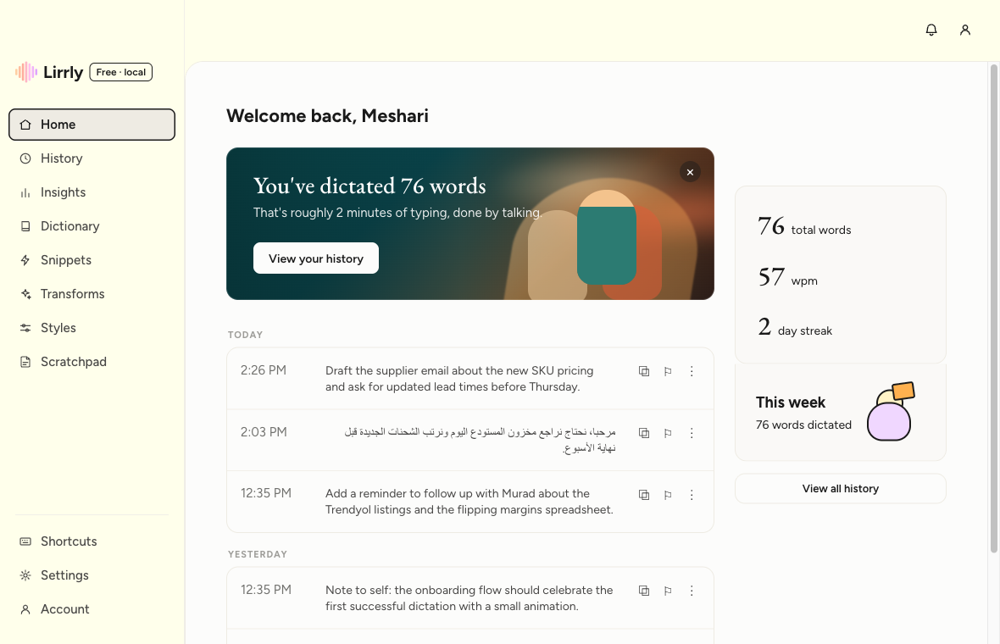

# Lirrly


Free, open-source macOS dictation. Speak → Whisper transcribes → AI cleans up → pastes at your cursor. **No account. No cloud storage. Yours.**

أفضل أداة إملاء عربي مفتوحة المصدر على macOS — تحافظ على لهجتك ولا تحوّلها إلى الفصحى.

Inspired by Wispr Flow; built independently with Tauri. Not affiliated with Wispr.




## Why Lirrly

- **One shortcut anywhere** — `⌘⇧D` records, transcribes, polishes, and pastes where your cursor is.
- **Privacy by architecture** — API key in the macOS Keychain, history in a local file, strict CSP, no analytics, no account. Audio goes only to the transcription API you configured.
- **Arabic-first** — dialect-preserving cleanup (no forced MSA), RTL history, and model guidance for Arabic accuracy. Wispr's weakest area is Lirrly's home turf.
- **Honest UI** — every control either works or says "Coming soon". No theater.

## What Works Now

- `⌘⇧D` global dictation: record → Groq Whisper → cleanup → paste, with clipboard restore
- `⌥T` transforms: select text in **any app** → the active transform (rewrite / summarize / formal / grammar / translate / your own) rewrites it in place · ✨ transform-and-copy from History
- First-run onboarding: permissions w/ live checks → key validation → first-dictation playground
- Floating Lirrly bar: collapsed handle → hover dock (language / dictate / polish / scratchpad), live waveform, actionable error toasts
- Shortcut rebinding (end-to-end, conflict-safe) · real microphone selection · launch at login · bar opacity
- Dictionary → recognition hints · Snippets (single-pass expansion) · per-context styles · AI cleanup w/ deterministic fallback
- History (local file via Tauri store) with search/sort, RTL rows, honest WPM from measured durations
- Menu-bar tray: template-tinted glyph, paste last transcript, languages, links; system notification on failures when the bar is hidden
- 5-minute recording cap + 25 MB guard · 60s network timeout · milestone celebrations 🎉

## Stack

- **Tauri v2** (Rust) + **React 19 + TypeScript** (Vite 7) — [why not a VoiceInk fork →](../docs/adr/001-stack-tauri.md)
- Rust owns: Groq API calls (key never reaches the webview), Keychain, global shortcut, paste synthesis (enigo), accessibility preflight, tray
- `src/lib/engine.ts` is the engine boundary — a local whisper.cpp backend can slot in behind it (roadmap)

## Run It

```bash
# real Apple clang must be used; .cargo/config.toml already points the linker at /usr/bin/cc.
cd lirrly
npm install
npm run tauri dev
```

## First-Time Setup

The onboarding wizard walks you through all of this on first launch:

1. **Groq API key** — free at [console.groq.com/keys](https://console.groq.com/keys); validated and stored in the macOS Keychain.
2. **Microphone** — granted on first dictation.
3. **Accessibility** — System Settings → Privacy & Security → Accessibility → add Lirrly (needed to paste at your cursor).
4. Put your cursor in any text field, press `⌘⇧D`, speak, press again — text appears.

## Quality Gates

```bash
npm run build && npm run lint && npm test          # tsc + vite, ESLint 9, Vitest
cd src-tauri && cargo clippy -- -D warnings && cargo fmt --check
```

CI runs all of the above on every push (`.github/workflows/ci.yml`). Release/signing steps: [docs/RELEASE.md](../docs/RELEASE.md).

## Roadmap (honest)

Badged "Coming soon" in-app until real: **Command mode** (select text → *speak* the instruction → rewrite in place; the typed-transform half shipped in v0.3), **Scratchpad**, per-app context auto-styles, hold-to-talk, local whisper.cpp engine (offline/$0 — design in [ADR-003](../docs/adr/003-local-streaming-engine.md)), update notifications, and a live recording-state tray glyph. Distribution: notarized direct download, not the Mac App Store ([ADR-002](../docs/adr/002-distribution-developer-id-not-mas.md)).

## License

[MIT](../LICENSE) — fork it, ship it, make it yours.
